<font face="Source Code Pro"/>

[toc]

## 绪论

### 基本概念

- **数据**是对客观事物的符号表示，在计算机科学中是指所有能输入到计算机中并被计算机程序处理的符号的总称。
- **数据元素**是数据的基本单位，在计算机程序中通常作为一个整体进行考虑和处理。
- 一个数据元素可由若干个**数据项**组成。数据项是数据不可分割的最小单位。
- **数据对象**是性质相同的数据元素的集合，是数据的一个子集。

> 图书馆里的所有书的书目信息可以看作一个数据；
> 某一本书的书目信息就是一个数据元素；
> 这本书的书名、作者名、出版时间等就是一个数据项。

#### 数据结构

**数据结构**是相互之间存在一种或多种特定关系的数据元素的集合。数据元素之间的关系称为**结构**。
> **数据对象**不强调元素之间的关系，**结构**强调的是元素之间的关系。

##### 四类基本结构

- **集合**：元素之间除同属一个集合外无其他关系。
- **线性结构**：元素之间存在**一对一**的关系。即除第一个元素外，每个元素都有唯一前驱；除最后一个元素外，每个元素都有唯一后继。
- **树形结构**：元素之间存在**一对多**的关系。
- **图状结构**（无向）或**网状结构**（有向）：元素之间存在**多对多**的关系。

数据结构的三要素：**逻辑结构**、**物理结构**、**运算方法**。

- **逻辑结构**：[结构](#数据结构)定义中的“关系”描述的是数据元素之间的逻辑关系，所以又叫**逻辑结构**。
- **物理结构**：数据结构在计算机中的表示（又称映像）称为数据的**物理结构**，又称**存储结构**。
  > 存储结构会影响：1. 存储空间分配的方便程度&nbsp;&nbsp;2. 数据的运算速度
  - **顺序存储**：逻辑上相邻的元素在物理上也相邻。元素间关系用存储单元的**邻接关系**来体现。
  - **链式存储**：逻辑上相邻，物理上不一定相邻。由**指针**来表示元素间的关系。
  - **索引存储**：建立附加的索引表来保存数据的**关键字**和**存储地址**。
  - **散列存储**：根据元素的关键字**计算出**存储地址，又叫哈希存储。

#### 数据类型

**数据类型**是一个**值的集合**和定义在这个值集上的**一组操作**的总称，包括非结构的**原子类型**（如整型、字符型、指针类型、空类型等）和**结构类型**。

##### 抽象数据类型

**抽象数据类型**是指一个数学模型以及定义在该模型上的一组操作。 抽象数据类型的定义仅取决于它的一组**逻辑特性**，而与其在计算机内部如何表示和实现无关。

---

### 算法和算法分析

**算法**是对特定问题求解步骤的一般描述，它是指令的有限序列，其中每一条指令表示一个或多个操作。 算法具有以下5个重要特性：

1. **有穷性**：一个算法总是在执行**有穷步**后结束，且每一步可在**有穷时间**内完成。
   > 算法必须是有穷的，程序可以是无穷的。
2. **确定性**：对于相同的输入只能得出相同的输出。
3. **可行性**：算法中描述的操作都是可以通过已经实现的基本运算执行有限次来实现的。
4. **输入**：一个算法有**零个或多个**输入。
5. **输出**：一个算法有**一个或多个**输出。

#### 算法复杂度

算法中基本操作重复执行的次数是问题规模 $n$ 的某个函数 $f(n)$，算法的时间量度记作 $T(n)=O(f(n))$，表示随问题规模 $n$ 的增大，算法执行时间的增长率和 $f(n)$ 的增长率相同，$T(n)$ 称作算法的**渐进时间复杂度**，简称**时间复杂度**。

**算法复杂度排序**：$O(1)\lt O(\log{n})\lt O(n)\lt O(n\log{n})\lt O(n^2)\lt O(n^3)\lt O(2^n)\lt O(n!)\lt O(n^n)$
**加法规则**：$O(f(n))+O(g(n))=O(\max\{f(n), g(n)\})$
**乘法规则**：${O(f(n))}\times{O(g(n)})=O({f(n)}\times{g(n)})$
> 计算算法复杂度时，只保留次数最大项的一倍结果即可，且一般只考虑**平均**或**最差**时间复杂度。

---
---

## 线性表

**线性表**是具有**相同数据类型**的 $n$ 个数据元素的**有限**序列，其中 $n$ 为表长，当 $n=0$ 时线性表是一个**空表**。若将线性表记为 $(a_1, \dotsc, a_{i-1}, a_i, a_{i+1}, \dotsc, a_n)$，则称 $a_{i-1}$ 是 $a_i$ 的直接**前驱**元素，$a_{i+1}$ 是 $a_i$ 的直接**后继**元素，$i$ 为元素 $a_i$ 在线性表中的**位序**。
> **下标**是从0开始的，**位序**是从1开始的。

---

### 顺序表

线性表的顺序表示是指用一组**地址连续**的存储单元依次存储线性表的数据元素，即逻辑上相邻的元素物理存储上也相邻。
代码见[SqList.c](https://github.com/Marionette-yixuan/408_Data_Structure/blob/4c89d55ff33ef09fb5020dc81f9d692865706787/List/SqList/SqList.c)。

``` c
/* 线性表 */
#define LIST_INIT_SIZE 100      // 线性表存储空间的初始分配量
#define LISTINCREMENT 10        // 存储空间的分配增量

typedef struct {
  ElemType *elem;               // 存储空间的基址
  int length;                   // 当前线性表的长度
  int listsize;                 // 当前分配的存储容量（当前表的最大容量）
} SqList;
```

顺序表的特点：

- **随机访问**，即可以在 $O(1)$ 时间内找到第 $i$ 个元素。
- **存储密度高**，每个结点只存储数据元素。
- **拓展容量不方便**，必须要重新分配地址空间，然后迁移数据。
- **插入、删除操作不方便**，需要移动大量元素。

#### 顺序表的插入和删除

##### 插入操作 `ListInsert_Sq(SqList *L, int i, ElemType e)`

插入操作基本流程：

1. 判定插入位置i是否合法：i的合法范围为**1~L.length+1**。
2. 判定当前表是否已满。若已满，则需要增加表长、重新分配存储空间，然后迁移数据。
3. 获取插入位置的元素：L.elem[i-1]。
4. **从后往前**依次将插入位置（**含**）之后的元素**后移**。
5. 将新元素e插入表中。
6. 增加表长 L.length++。

时间复杂度：

- 最好情况：插入到**表尾**，不需移动元素，时间复杂度为 $O(1)$。
- 最坏情况：插入到**表头**，需要移动所有元素，时间复杂度为 $O(n)$。
- 平均情况：插入到各个位置的概率相同，时间复杂度为 $O(\frac{n}{2})=O(n)$。

##### 删除操作 `ListDelete_Sq(SqList *L, int i, ElemType *e)`

删除操作基本流程：

1. 判断删除位置i是否合法：i的合法范围为**1~L.length**。
2. 获得删除位置的元素：L.elem[i-1]。
3. **从前往后**依次将删除位置（**不含**）之后的元素**前移**。
4. 减少表长 L.length--。

时间复杂度：

- 最好情况：删除表尾元素，不需移动元素，时间复杂度为 $O(1)$。
- 最坏情况：删除表头元素，所有元素都需要前移，时间复杂度为 $O(n)$。
- 平均情况：插入到各个位置的概率相同，时间复杂度为 $O(\frac{n-1}{2})=O(n)$。

即在顺序存储结构的线性表中插入或删除一个数据元素，平均约移动表中**一半**的元素。

---

### 链表

线性表的链式存储结构是用一组**任意的**存储单元存储线性表的数据元素（可连续也可不连续）。 因此除了存储本身的数据信息外，还需要存储其直接后继的存放位置。这两部分信息共同构成一个**结点**，结点中存储数据信息的域叫做**数据域**
，存储直接后继信息的域叫做**指针域**。

链表的特点：

- 不要求大量**连续的**存储空间，改变容量方便。
- 不可随机存取，必须从首结点一路向下找到目标结点。
- 需要耗费一定空间用作指针域。
- 插入、删除元素操作简单。

#### 单链表

单链表是指指针域只有**一个**指向后继元素的指针的链表。
代码见[LkList.c](https://github.com/Marionette-yixuan/408_Data_Structure/blob/4c89d55ff33ef09fb5020dc81f9d692865706787/List/LkList/LkList.c)。

``` c
/* 单链表 */
typedef struct LNode {
  ElemType data;            // 数据域
  struct LNode *next;       // 指针域
} LNode, *LinkList;        // LNode强调结点本身，LinkList强调整个链表的指针
```

##### 实现方式

单链表有两种实现方式：带头结点&不带头结点。**头结点**是指一个数据域为空（也可以存储如表长之类的数据）、指针域指向整个链表第一个结点（**首结点**）的结点。两种实现方法的差异主要在**初始化**和**判空**的操作上。

- 不带头结点：不带头结点时，指向单链表的指针L（**头指针**）直接指向**首结点**。
  **初始化**方法：`L = NULL`，代表表中没有结点；
  **判空**方法：`L == NULL`，即头指针为空则说明表空。
  不带头结点时，在链表头部插入和删除元素时都需要更改头指针，不太方便。

- 带头结点：带头结点时，头指针L指向**头结点**。
  **初始化**方法：申请一片空间给头结点`head_node`，随后头指针`L`指向头结点、头结点的指针域置NULL。
  **判空**方法：`L.next == NULL`。L指向的是头结点，头结点没有后继元素代表链表为空。

判断结点p是否为表尾的操作（两种实现方法相同）：`p.next == NULL`
由于带头结点的单链表显然更加常用，所以以下操作均为带头结点的实现方法。

##### 插入操作 `ListInsert_Lk(LinkList L, int i, ElemType e)`

假设要插入的元素e存放在名为**s**的结点指针中，表中插入位置i的**上一个结点**的指针为**p**（即s结点插入到p的后侧），则关键步骤如下：

1. `s->next = p->next`，p原本的后继元素变为s的后继元素。
2. `p->next = s`，p的新后继元素为s。
   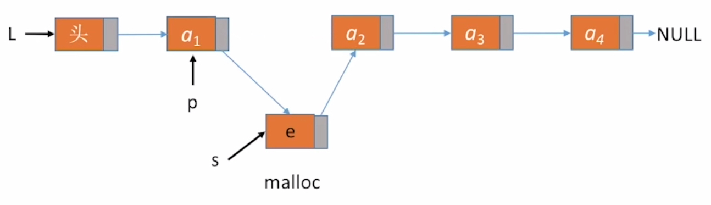

两步的顺序十分重要，不能颠倒！

时间复杂度：$O(n)$

> 指定结点**p**的**前插**操作：
> 方法一：从头结点找到p的前驱结点，进行插入。时间复杂度：$O(n)$
> 方法二：新建一个结点s插入到p后方，然后把p的数据内容复制到s中，随后用新元素e替换p中元素。时间复杂度：$O(1)$
> | s->next = p->next;
> | p->next = s;
> | s->data = p->data;
> | p->data = e;

##### 删除操作 `ListDelete_Lk(LinkList L, int i, ElemType *e)`

假设要删除结点（第i个结点）的**上一个结点**的指针为**p**（即删除p的下一个结点，设为**q**），则关键步骤如下：

1. `p->next = q->next`，p的新后继元素为要删除结点(q = p->next)的后继元素。
2. `free(q)`，释放q的存储空间，交还操作系统。
   

时间复杂度：$O(n)$

> 指定结点**p**的删除操作：
> 令**q**指向**p**的后一个结点，将q的数据域和指针域复制到p中，随后删除q结点。
> | q = p->next;
> | p->data = q->data;
> | p->next = q->next;
> | free(q);
> 除最后一个结点外都可以这样进行删除。时间复杂度：$O(1)$

单链表的局限性：**无法逆向检索**，要找到某个结点的前驱必须要从头结点进行遍历，花$O(n)$的时间复杂度。

#### 双链表

为了解决单链表无法逆向搜索的弊端，在指针域添加一个指向**前驱元素**的指针。牺牲少量存储密度换来更快捷的操作。
代码见[DuList.c](https://github.com/Marionette-yixuan/408_Data_Structure/blob/b7b40eaecb6fea49799191603d2131747b1fd70d/List/DuList/DuList.c)。

``` c
/* 双链表 */
typedef struct DNode {
  ElemType data;
  struct DNode *prior;    // 前驱指针域
  struct DNode *next;     // 后继指针域
} DNode, *DoubleList;
```

##### 初始化&判空（默认带头结点）

初始化时，申请一片内存空间用来存放头结点`head_node`，并将`head_node`的**前驱**和**后继指针域**置为NULL，随后双链表指针指向头结点。在后续操作中，头结点的前驱指针域**始终为NULL**。后继指针域指向首结点。
判空操作与单链表相同，`L->next == NULL`，即根据头结点的后继指针是否为NULL来判定。

##### 插入操作 `ListInsert_Du(DoubleList D, int i, ElemType e)`

假设要插入的元素e存放在名为**s**的结点指针中，表中插入位置i的**上一个结点**的指针为**p**（即s结点插入到p的后侧），则关键步骤如下：

1. `s->next = p->next`，同单链表。
2. `p->next->prior = s`，将原表中p的后继结点的前驱域（原本指向p）指向s。
3. `s->prior = p`，p为s的前驱。
4. `p->next = s`，同单链表。
   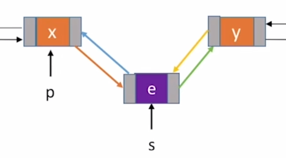

其中，2/3步的位置可以互换，其余两步位置固定。
第2步中，若插入在最后一个结点后方，可能会出现空指针的错误，所以要先判断`p->next == NULL`，即p有无后继结点。
对于前插操作，只需要找到i位置结点的前一个结点，再进行后插操作即可。

##### 删除操作 `ListDelete_Du(DoubleList D, int i, ElemType *e)`

假设要删除结点（第i个结点）的**上一个结点**的指针为**p**（即删除p的下一个结点，设为**q**），则关键步骤如下：

1. `p->next = q->next`，同单链表。
2. `q->next->prior = p`，p为原本q的后继结点的前驱。
3. `free(q)`，释放空间。
   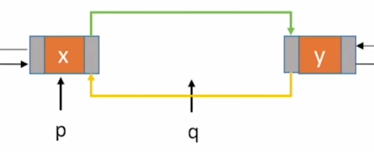

同样，第2步可能会出现空指针的错误，需要进行判断。

#### 循环链表

循环链表分为循环单链表和循环双链表，其最大的特征是尾结点的后继指针不为NULL。

##### 循环单链表

循环单链表中，**尾结点的后继指针域回指向头结点**，而普通单链表的尾结点后继指针域则为NULL。
> 循环链表可以从任意一个结点出发，向后遍历找到任意一个结点。

代码见[CrList.c](https://github.com/Marionette-yixuan/408_Data_Structure/blob/80dbb854256203134a2307fb771bf9a23519117d/List/CrList/CrList.c)
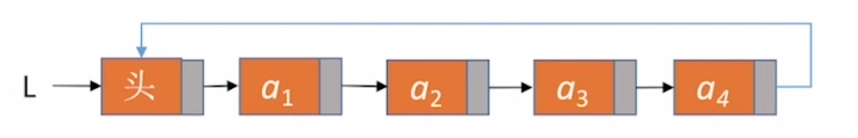

###### 初始化&判空&判表尾

- **初始化**：头结点`head_node`的指针域应指向头结点本身，即`head_node->next = head_node`。其余与单链表相同。
- **判空**：循环链表`C`为空的条件为`C->next == C`，即头结点的指针域指向自己。
- **判表尾**：结点`p`为循环链表`C`的表尾元素的条件为`p->next == C`，即指针域指向头结点。

###### 尾指针

由于对链表的很多操作都是在表头或者表尾进行，而从**头指针找到尾部**需要$O(n)$的时间复杂度，所以在循环链表中，可以不设头指针而改用**尾指针**，由**尾指针找到头部**只需要$O(1)$的时间复杂度，大大简化。当然，需要在**表尾**插入和删除元素时需要修改尾指针的值。

##### 循环双链表

循环双链表在循环单链表的基础上，**尾结点的后继指针域指向头结点、头结点的前驱指针域指向尾结点**，与之相对的双链表的上述两个指针域均为NULL。 这部分没有代码。
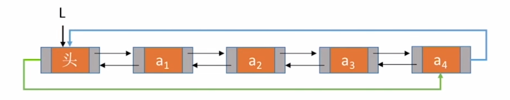

###### 初始化&判空&判表尾

- **初始化**：头结点`head_node`的前驱指针域和后继指针域均指向自己。
- **判空**：循环链表`C`为空的条件为`C->next == C`或`C->prior == C`，即头结点的两个指针域均指向自己。
- **判表尾**：结点`p`为循环链表`C`的表尾元素的条件为`p->next == C`，即指针域指向头结点。

##### 循环链表的插入和删除

在双链表的插入和删除操作（见[双链表](#插入操作-listinsert_dudoublelist-d-int-i-elemtype-e)）中，需要判定操作位置是否为表尾，否则会出现空指针异常。而在循环链表中由于表尾元素的后继指针域不为NULL，所以无需进行判定，直接进行操作即可。

#### 静态链表

分配一整片连续的内存空间，每个内存单元中存放一个链表的结点，如下图。
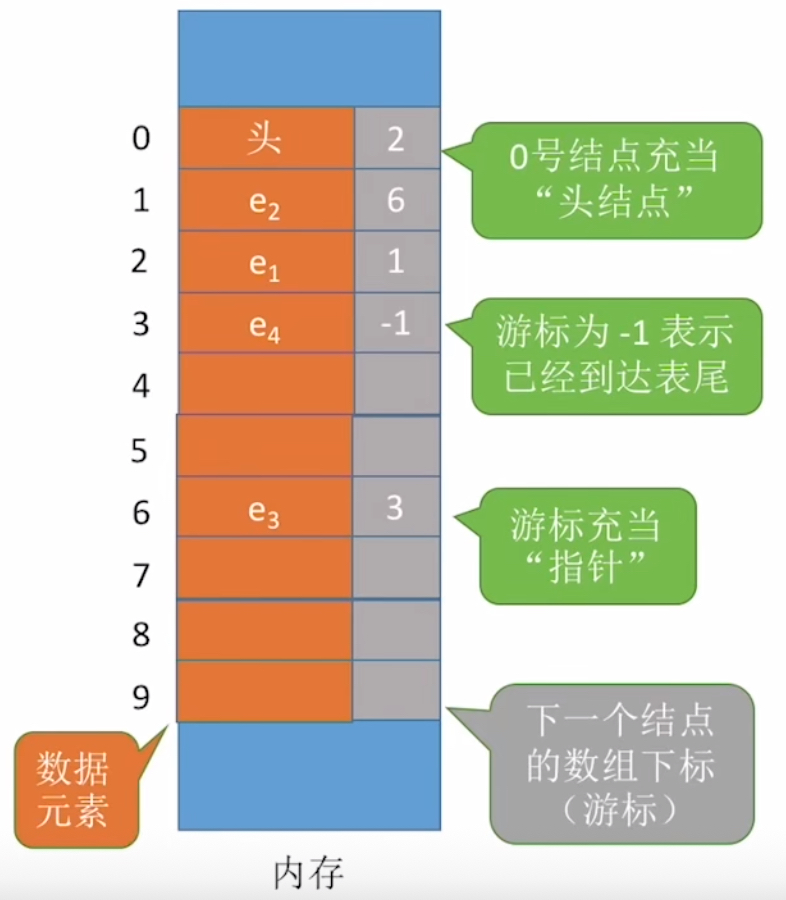

- 优点：增删操作不需要移动大量元素
- 缺点：不能随机存取，查找需要从头遍历元素。容量**固定不可变**。

适用场景：不支持指针的低级语言；数据元素数量固定不变的场景（如OS的文件分配表FAT）。 这部分没有代码。

``` c
/* 静态链表 */
#define MaxSize 10  // 静态链表的最大长度
typedef struct {
  ElemType data;    // 静态链表结构类型的定义
  int next;         // 下一个元素的数组下标
} SLinkList[MaxSize];   // SLinkList直接就是数组类型
```

##### 基本操作的实现方法

- **查找**：从头结点出发遍历后序结点（$O(n)$）
- **插入**第i个位置：
  1. 在表的内存空间中找到一个空（需预先设置**空结点**的特征，如`next = -2`）的结点`s`，存入数据
  2. 查找第i-1个结点`p`
  3. `s->next = p->next`
  4. `p->next = s`
- **删除**i位置的结点：
  1. 查找第i-1个结点`p`和第i个结点`q`
  2. `p->next = q->next`
  3. `q->next = -2`，表示这个结点为空了

---
---

## 栈和队列

### 栈

栈是限定仅在**表尾**进行插入或删除操作的**线性表**，栈的表尾被称作**栈顶**、表头端称为**栈底**。 栈的特点就是**后进先出**（**LIFO**），后压入栈的元素会先出栈。

栈最重要的两个操作:

- **压栈**（**Push**）：将一个元素放置在栈顶。
- **弹栈**（**Pop**）：将栈顶元素取出。

#### 合法出栈序列

若有$n$个元素依次进栈，则有 $\frac{1}{n+1}\mathrm{C}^n_{2n}$ 种合法的出栈序列。 其中，若元素以 $\cdots{A}\cdots{B}\cdots{C}\cdots$ 的顺序入栈，则**不可能**出现 $\cdots{C}\cdots{A}\cdots{B}\cdots$ 的出栈序列。

#### 顺序栈

**顺序栈**就是利用一组地址连续的存储单元依次存放自栈底到栈顶的数据元素，同时附设**top指针**指示栈顶元素在顺序栈中的位置。
代码见[SqStack.c](https://github.com/Marionette-yixuan/408_Data_Structure/blob/60da0b8eccf94b4c216f3267cb0d16a21454227a/Stack/SqStack/SqStack.c)。

``` c
/* 顺序栈 */
typedef struct {
  ElemType *base;       // 栈存储空间的基址，指向栈底的位置
  ElemType *top;        // 当前栈顶的地址
  int stack_size;       // 该顺序栈的最大容量
} SqStack;
```

- `base == NULL`说明栈**不存在**。
- `base == top`说明栈中无元素，为**空栈**。
- `top - base >= stack_size`说明栈**已满**。

> 教材上初始时`base == top`，每压入一个元素`top++`，这样会使top始终指向栈顶元素的**下一个位置**。
> 有些题目中会使top指针指向栈顶元素**本身**（王道网课的第一种方式top指针就是指向栈顶本身），记得读题。

##### 压栈操作 `Push(SqStack *S, ElemType e)`

关键步骤：

1. `S->base[top] = e`，将新元素放置在栈顶位置。
2. `S->top++`，栈顶指针增加。

> 如果是使用的第二种实现方法（top直接指向栈顶元素），则需要调换两步的位置，先增加top指针再入栈。

除此之外还要先进行栈满的判断，若已满则要重新分配更大的存储空间。

##### 弹栈操作 `Pop(SqStack *S, ElemType *e)`

关键步骤：

1. `S->top--`，先减少栈顶指针，使其指向栈顶元素。
2. `*e = S->base[top]`，元素出栈。

> 同样如果是使用的第二种实现方法，则先元素出栈再减少栈顶指针。

除此之外还要先进行栈空的判断，若为空则返回错误信息。

##### 共享栈

**共享栈**是顺序栈的一种变体，为两个栈共享同一片连续的内存空间， 栈底分别是内存空间的上下限，两个栈分别向中间生长。 这部分没有代码。

``` c
/* 共享栈：教材上没有这部分的介绍，所以使用了王道书上的定义风格 */
typedef struct {
  ElemType data[MaxSize];     // 静态数组代表连续内存空间
  int top0;                   // 0号栈栈顶指针
  int top1;                   // 1号栈栈顶指针
} ShStack;
```

**初始化**：`top0 = -1`，代表0号栈的栈顶元素在data[-1]（即没有元素）；`top1 = MaxSize`，代表1号栈的栈顶元素在data[MaxSize]（即没有元素）。
> **-1**和**MaxSize**都超出了数组的下标范围，可见这里使用的是第二种实现方式，即top指针直接指向栈顶元素。

**栈满**：`top1 - top0 == 1`，说明top1和top0相邻了，即两个栈生长到同一个位置了。

#### 链栈

**链栈**就是用单链表实现的栈结构，其定义与[单链表](#单链表)相同。其中，头结点的一端用作栈顶，方便操作。对于两种不同实现方式，对应的基本操作也略有不同。

- 不带头结点： 只在**头指针处**进行插入、删除，对应压栈、弹栈操作。
- 带头结点： 只在**头结点后**进行插入、删除，对应压栈、弹栈操作。

代码见[LkStack.c](https://github.com/Marionette-yixuan/408_Data_Structure/blob/60da0b8eccf94b4c216f3267cb0d16a21454227a/Stack/LkStack/LkStack.c)。

#### 栈的应用

这一部分包括括号匹配、中缀表达式转后缀表达式以及后缀表达式求值。
其中括号匹配比较简单，就不给出文字描述了，代码在[LkStackMain.c](https://github.com/Marionette-yixuan/408_Data_Structure/blob/60da0b8eccf94b4c216f3267cb0d16a21454227a/Stack/LkStack/LkStackMain.c)中的`test3_19()`函数中。
另外两个应用的手算方法同样没有技术含量，下面只整理了计算机的处理方法。

##### 中缀表达式转后缀表达式

> 后缀表达式又称**逆波兰表达式**。

转换过程：

1. 初始化一个栈，来保存**不能确定运算顺序**的运算符（能确定的已经加到表达式里了）。
2. 从左到右处理中缀表达式：
    1. 遇到**操作数**：直接加入后缀表达式。
    2. 遇到**界限符**（即 **'('** 和 **')'**）： 遇到'('则直接入栈， 遇到')'则依次弹出栈内所有运算符并加入后缀表达式，直到遇到'('为止，然后将'('弹出但**不加入**表达式。
    3. 遇到**运算符**： 依次弹出栈内所有优先级**高于或等于**当前运算符的所有运算符，并加入后缀表达式。碰到'('或者栈空时停止， 之后将当前运算符入栈。
3. 读入结束后，将栈中剩余符号依次加入后缀表达式。

实例见[InToPost.pdf](https://github.com/Marionette-yixuan/408_Data_Structure/blob/34b23bca6e051bcfca4f051900283e2284972237/z_examples/InToPost.pdf)

##### 计算后缀表达式

计算过程：

1. 初始化一个数值栈，用来存放未参与运算的操作数。
2. 从左到右处理后缀表达式：
    1. 遇到**操作数**：压入数值栈。
    2. 遇到**运算符**：从数值栈中弹出两个操作数（**先弹出的是右操作数**）进行运算，随后将结果压回栈中。
3. 处理完成后，栈中应该只剩下一个操作数，即为结果。

---

### 队列

**队列**是只允许在**一端**进行插入、**另一端**进行删除的线性表。允许入队（插入）的一端称为**队尾**，允许出队（删除）的一端称为**队头**。 队列的特点和栈正相反，为**先进先出**(FIFO)，先入队的元素会先出队。

队列的两个重要操作：

- **入队（EnQueue）**：将一个元素放置在队尾。
- **出队（DeQueue）**：将队头的元素取出。

#### 顺序队列

用顺序存储的方式实现的队列，需要用base指针来指示连续内存空间的基址，以及指示队头和队尾的两个指针front和rear。由于rear和front指针会在连续的内存中循环移动，所以更常见的名称是**循环队列**。
代码见[SqQueue.c](https://github.com/Marionette-yixuan/408_Data_Structure/blob/acb5db88088f6894442ebfe9d8dc650f6d6e84d9/Queue/SqQueue/SqQueue.c)。
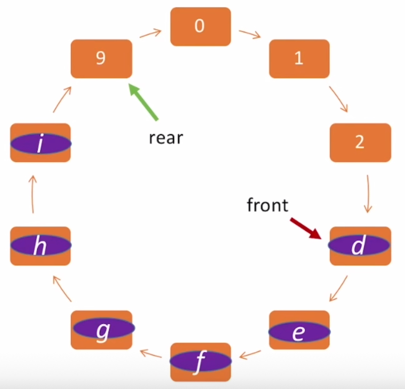

``` c
/* 顺序队列 */
#define MAXQSIZE 100
typedef struct {
  ElemType *base;
  int front, rear;
} SqQueue;
```

初始时rear = front = 0，有元素入队则入队后rear++，有元素出队则出队后front++。因此rear始终指向队尾元素的**下一个位置**，而front**直接**指向队头元素（这里需要好好理解一下）。
> 同样，有的题目让rear也**直接**指向队尾元素，此时初始化时`rear = MAXQSIZE - 1`（相当于-1）。下述判空判满的操作也要对应修改。

- `base == NULL`说明队列**不存在**。
- `rear == front`说明队列为**空**。
- `front == (rear + 1) % MAXQSIZE`说明队列**满**，即队尾指针在队头的**上一个位置**。
  > 此时虽然rear指向的那个内存单元没有元素，但也不能使用，否则会出现`rear == front`的情况，误认为队列为空。故这种存储方法，队列中最多存放**MAXQSIZE-1**个元素。

> 能让队列存放MAXQSIZE个元素的方法：
> 在队列的定义中加入一个变量`size`来记录**队列中元素个数**：`size = (rear + MAXQSIZE - front) % MAXQSIZE`。当然，要更改判定队满的条件。
> 加入一个标志位`tag`来记录**上一个操作是插入还是删除**：只有插入操作才能使队列变为满的状态，只有删除操作才能使队列变为空的状态，即在判定满/空时条件均为`rear == front`，根据tag的值确定满还是空。

##### 入队操作 `EnQueue(SqQueue *Q, ElemType e)`

关键步骤：

1. 判断是否队列已满，若满则报错（不像之前那样扩充存储空间了）
2. `Q->base[Q->rear] = e`，新元素插入队尾。
3. `Q->rear = (Q->rear + 1) % MAXQSIZE`，队尾指针循环后移。

> 与栈一样，如果rear指针直接指向队尾元素，则先循环后移再入队。

##### 出队操作 `DeQueue(SqQueue *Q, ElemType *e)`

关键步骤：

1. 判断队列是否为空，若空则报错
2. `*e = Q->base[Q->front]`，取出队头元素。
3. `Q->front = (Q->front + 1) % MAXQSIZE`，队头指针循环后移。

#### 链队列

**链队列**即用链式存储结构实现的队列，由于队列是在链表的头尾进行操作，所以设立两个指针front和rear。front指向链表的头结点、rear指向链表的尾结点。
同样有两种不同的实现方法，即带头结点和不带头结点，两种方法的实现大同小异，下面只介绍带头结点的实现。
代码见[LkQueue.c](https://github.com/Marionette-yixuan/408_Data_Structure/blob/acb5db88088f6894442ebfe9d8dc650f6d6e84d9/Queue/LkQueue/LkQueue.c)。

``` c
typedef struct QueueNode {
  ElemType data;
  struct QueueNode *next;
} QNode;
typedef struct {
  QNode *front;
  QNode *rear;
} LinkQueue;
```

- **初始化**：带头结点时，申请一片空间存储头结点`head_node`，并将front和rear指针**一起指向head_node**。不带头结点时，front = rear = NULL。
- **判空**：`front == rear`即为队列空的标志。

##### 入队操作 `EnQueue(LinkQueue *Q, ElemType e)`

入队即在链表的尾部插入一个新结点，关键步骤如下：

1. 申请一片空间存储新结点s。
2. `s->next = NULL`，因为s会被插到最后一位，指针域必定为NULL。使用`s->next = Q->rear->next`结果相同。
3. `Q->rear->next = s`，将s连在原队尾的后面。
4. `Q->rear = s`，s是新的队尾。

> 若不带头结点，则要先判断s是不是队列里的第一个元素，见`EnQueue_Wo(LinkQueue *Q, ElemType e)`。

##### 出队操作 `DeQueue_Wo(LinkQueue *Q, ElemType *e)`

出队即删除链表头结点后的首结点，关键步骤如下：

1. 判断队列是否为空，为空则报错。
2. 找到首结点de_node。
3. `*e = de_node->data`，取出出队结点的数据。
4. `Q->front->next = de_node->next`，`Q->front`为头结点，将头结点的指针域指向原队头的后继。
5. 判断队列是否为空，为空则`Q->rear = Q->front`，此时二者应该都指向head_node。
6. `free(de_node)`，释放空间。

> 若不带头结点，只有找首结点的操作有些不同，见`DeQueue_Wo(LinkQueue *Q, ElemType *e)`。

---

### 双端队列

**双端队列**是只允许从**两端插入**、**两端删除**的线性表。还包括以下两个变种：

- **输入受限**的双端队列：只允许从**一端插入**、**两端删除**的线性表。
- **输出受限**的双端队列：只允许从**两端插入**、**一端删除**的线性表。
  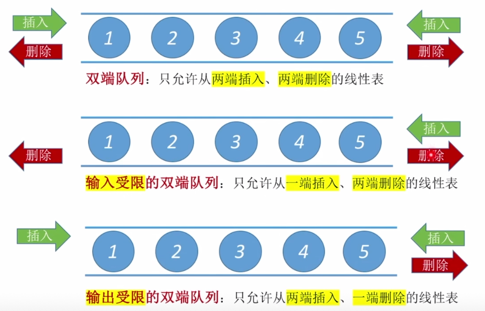

可能的考点只有判断**输出序列的合法性**，其判断的唯一准则是：**一个元素输出前必须先输入**。 普通的双端队列能够实现任意一种输出序列，而针对两种受限的双端队列有以下技巧：

- 输入受限：先排好**入队顺序**（因为只有一端能够入队），看入队序列能否实现对应的输出序列。
- 输出受限：先排好**出队顺序**（因为只有一端能够出队），看有没有能实现它的入队序列。

---
---

## 串

**串**（或字符串）是由零个或多个**字符**组成的有限序列。 串中字符的数目 $n$ 称为串的**长度**，零个字符的串称为**空串**，用$\varnothing$表示。 由一个或多个**空格**组成的串称为**空格串**。
串中任意个连续的字符组成的**子序列**称为该串的**子串**，包含子串的串相应地称为**主串**。子串在主串中的位置以子串的第一个字符在主串中的位置来表示。
> 子串和子序列：**子序列**只要求字符的出现顺序，而**不要求字符连续**。因此子串一定是子序列，但子序列不一定是子串。
> 字符串中字符的序号同样从1开始。

两个串是**相等**的当且仅当这两个串的值相等，即**串长**和**每个对应位置的字符**都相等时才相等。

串的几个基本操作：

- **字符串比较** `StrCompare(S, T)`：按位比较S和T的每一位字符，遇到不一样的位则返回字符**ASCII码**的差值，若前缀完全一样，则返回**串长**的差值。
- **字符串拼接** `Concat(Q, S, T)`：将S和T拼接的结果存储到Q中。
- **求子串** `SubString(Q, S, pos, len)`：将串S第pos个字符起长度为len的子串存储到Q中。
- **模式匹配** `Index(S, T, pos)`：返回串T在串S第pos个字符后第一次出现的位置下标。
> 以上前三个操作比较简单，不同存储结构的实现略有不同，就不展开介绍了。模式匹配将在后面单独整理。

### 串的顺序存储

字符串的顺序存储主要分为两大类，即**静态数组**和**动态数组**两种。静态数组的存储方式中字符串的最大长度是固定的，又叫**定长顺序存储**；动态数组的方式通过基址指针来指示字符串的存放位置，又叫**堆分配存储**。
代码见[SqString.c](https://github.com/Marionette-yixuan/408_Data_Structure/blob/c7dc0235d5367eeaccb2bb0de9ee2afb71648091/String/SqString/SqString.c)。

#### 定长顺序存储

定长顺序存储又有四种不同的方案，假设固定的字符串最大长度为`MAXSTRLEN`，下面一一进行介绍：
- **方案一**：
  ``` c
  typedef struct {
    unsigned char ch[MAXSTRLEN];    // 静态数组
    int length;                     // 串长
  } SString1;
  ```
  使用一个变量`length`来存储**串长**，存储字符串的最大长度为`MAXSTRLEN`。
- **方案二**：
  ``` c
  typedef unsigned char SString2[MAXSTRLEN];
  ```
  使用`SString2[0]`来存储串长，这样存储字符串的最大长度为`MAXSTRLEN - 1`，但优点是字符的位序和下标相同。
- 方案三：
  ``` c
  typedef unsigned char SString3[MAXSTRLEN];
  ```
  使用`'\0'`作为串的结尾，不存储串长。同样存储字符串的最大长度为`MAXSTRLEN - 1`。在需要经常获取字符串长度的情况下，这种方案**很不好用**。
- **方案四**（教材的实现方法）：
  ``` c
  typedef struct {
    unsigned char ch[MAXSTRLEN];
    int length;
  } SString4;
  ```
  将`ch[0]`弃用，使用`length`变量来存储串长，这样综合了方案一和二的优点，最大长度为`MAXSTRLEN - 1`。

#### 堆分配存储

堆分配存储结构的串既有顺序存储结构的优点，又对串长没有限制，更加灵活。

``` c
/* 堆分配存储 */
typedef struct {
  char *ch;     // 按串长分配存储区，ch指向串的基址
  int length;   // 串的长度
} HString;
```

### 串的链式存储

字符串也可以用链表的方式来存储，只不过如果每个结点中的元素都只是**一个**字符的话，存储密度过低（每5B中有4B是指针），所以需要在每个结点中存储**多个**字符，这种方式称为串的**块链存储**。
代码见[LkString.c](https://github.com/Marionette-yixuan/408_Data_Structure/blob/c7dc0235d5367eeaccb2bb0de9ee2afb71648091/String/LkString/LkString.c)。
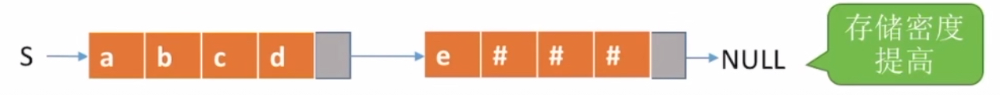

在块链存储的方式中，还设置两个指针`head`和`tail`用于指示整个字符串的头尾，以及一个记录当前串长的变量`curlen`，方便操作。

``` c
#define CHUNKSIZE 5         // 每个块中存放的字符数量
typedef struct Chunk {      // 块链中的一个块
  char ch[CHUNKSIZE];       // 数据部分
  struct Chunk *next;
} Chunk;
typedef struct {
  Chunk *head, *tail;       // 头尾指针
  int curlen;               // 当前串长
} LString;
```

### 串的模式匹配算法

子串的定位操作通常称作串的**模式匹配**（其中T称为**模式串**），即要在主串中找到与模式串相同的子串，并返回其所在位置（若没有则返回0）。
代码见[PatternConform/SqString.c](https://github.com/Marionette-yixuan/408_Data_Structure/blob/08d160e480f4be60fbfd5341eb81c830a5fb596c/String/PatternConform/SqString.c)。

#### 朴素模式匹配算法 `Index(SString4 S, SString4 T, int pos)`

算法的基本思想是：从主串S的第pos个字符起，和模式串T的**第一个字符**比较，若相同，则继续比较后续字符；否则从主串的**下一个字符**开始再重新和模式串的字符进行比较。
这种算法属实暴力，设主串和模式串的长度分别为$n$和$m$，则该算法的复杂度为$O({m}\times{n})$。

#### KMP算法 `Index_KMP(SString4 S, SString4 T, int pos)`

在暴力算法中，每次**失配**都要将模式串移回主串的下一个字符再进行比较。但实际上在上一轮比较中，已经可以知道回溯到哪个位置必定会失配，所以将模式串少回溯几位，能够有效地减少时间复杂度。
为此，针对模式串提出**next数组**，在模式串的j位置和主串的i位置失配时，只回溯到**模式串的next[j]位置**与**主串i位置**对齐的地方进行新一轮比较。
设主串和模式串的长度分别为$n$和$m$，则该算法的复杂度为$O({m}+{n})$。

##### next数组的计算 `get_next(SString4 T)`

next数组有两种方式计算，模式串较长的时候适用第一种方法（老师讲的方法），较短的时候适用第二种方法（教材上的方法）。两种方法的字符串下标都从1开始计算。
实例见[KMP_next.pdf](https://github.com/Marionette-yixuan/408_Data_Structure/blob/36d4bb2e40013d65d124eec9e03b1574f04e8078/z_examples/KMP_next.pdf)。

###### 第一种方法

1. 直接赋值：next[1] = 0, next[2] = 1。
2. 求next[m]，看m-1位上的字符与next[m-1]位上的字符是否相同。
    - 若相同，则`next[m] = next[m-1] + 1`
    - 若不同，则比对m-1位上的字符与next[next[m-1]]位上的字符，若相同，则`next[m] = next[m-1] + 1`。若不同则继续根据next值往前看，直到看到第一位，无论是否相同，`next[m] = 1`。
      > 和哪位相同就是哪位的next值加1。

> 真是太难描述了，建议手动算一遍会理解得更好。

###### 第二种方法

next[1] = 0, next[2] = 1， next[j] = 前j-1个字符所组成的串中最长相同前后缀的长度 + 1
> **前缀**：含首个字符、不含末尾字符；**后缀**：含末尾字符、不含首个字符。

##### nextval数组的计算 `get_nextval(SString4 T)`

**nextval数组**是在next数组的基础上计算出来的，能够进一步稍微增加运算速度。 修改方法：如果next[j] = k，且模式串T[j] = T[k]，则next[j]应改为next[k]。

##### KMP全过程

1. 初始`i = j = 1`，分别指向主串S和模式串T的第一个字符。比对时只有j会减小、i永远增大。
2. 若主串S[i]和模式串T[j]匹配，则`i++, j++`，匹配下个字符。
3. 若不匹配，则将j移回next[j]（如果用了nextval数组则移回nextval[j]），再与S[i]进行比较。
4. 若j=0，说明模式串的第一位都无法与S[i]匹配（只有next[j]=0），故`i++`，匹配主串下个字符；`j++`，让j=1，从头开始匹配模式串。
5. 若匹配时发生越界，则说明找不到匹配的位置，返回0。

实例见[KMP.pdf](https://github.com/Marionette-yixuan/408_Data_Structure/blob/08d160e480f4be60fbfd5341eb81c830a5fb596c/z_examples/KMP.pdf)。

---
---

## 树和二叉树

树是$n$个结点的有限集合。$n=0$ 时称为**空树**。而对于任何一棵非空树，应该满足： $\circ$ 有且仅有一个特定的称为**根**的结点。 $\circ$ 当 $n>1$ 时，其余结点可分为$m$个互不相交的有限集合 $T_1, T_2, \cdots, T_m$，其中每个集合本身又是一棵树，并且称为根结点的**子树**。

### 相关概念&性质

相关概念：
$\circ$ **度**：结点拥有的**子树**的数量称为**结点的度**，树内各个结点的度的**最大值**称为**树的度**。
  > 树中的结点数 = 每个结点的**度**之和 + 1

$\circ$ **叶子**：度为0的结点称为**叶子**或终端结点。
$\circ$ **层次/深度**：**结点的层次**从**根**开始定义起，根为第一层、根的孩子为第二层，以此类推。树中结点的**最大层次**称为**树的深度**或高度。
$\circ$ 有序树/无序树：如果将树中结点的各子树堪称从左至右是有顺序的，则称该树为**有序树**，否则称为**无序树**。
$\circ$ **森林**：**森林**是$m$棵互不相交的树的集合。

常考性质：
$\circ$ 度为$m$的树和$m$叉树的区别：
|度为$m$的树|$m$叉树|
|:--:|:--:|
|任意结点的度$\le{m}$|任意结点的度$\le{m}$|
|至少有一个结点的度$={m}$|允许所有结点的度都$\lt{m}$|
|一定是非空树，至少有$m+1$个结点|甚至可以是空树|
$\circ$ 度为$m$的树、$m$叉树的第$i$层**至多**有$m^{i-1}$个结点
$\circ$ 高度为$h$的$m$叉树**至多**有$\frac{m^h-1}{m-1}$个结点（等比数列求和公式）。
$\circ$ 高度为$h$的$m$叉树**至少**有$h$个结点，高度为$h$、度为$m$的树**至少**有$h+m-1$个结点.
$\circ$ 具有$n$个结点的$m$叉树的**最小高度**为$\lceil{\log_m{(n(m-1)+1)}}\rceil$。
> 高度最小的情况：所有结点都有$m$个孩子，即
> $$\begin{gather*} \frac{m^{h-1}-1}{m-1}\lt{n}\le\frac{m^h-1}{m-1}\\ {h-1}\lt{\log_m{(n(m-1)+1)}}\le{h} \end{gather*} $$

---
### 二叉树

二叉树是$n$个结点的有限集合： $\circ$ $n=0$时，为**空二叉树**。 $\circ$ $n>0$时，由一个**根结点**和两个互不相交的、被称为根的**左子树**和**右子树**组成，左子树和右子树又分别是一棵二叉树。
二叉树的特点：1. 每个结点至多只有两棵子树。2. 左右子树不能颠倒，即二叉树是**有序树**。

#### 特殊的二叉树

1. **满二叉树**：一棵高度为$h$，且含有$2^h-1$个结点的二叉树（每一层的结点数都是最大结点数）。
   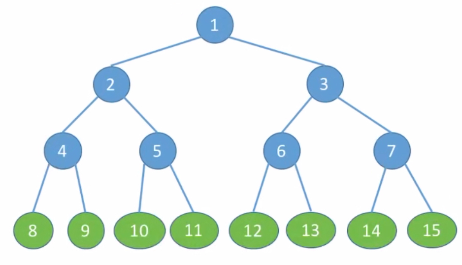

   > **特点**：
   > $\circ$ 只有**最后一层**有叶子结点。
   > $\circ$ **不存在**度为1的结点。
   > **$\circ$** 按层序（上到下）从1开始编号，结点$i$的**左孩子**为$2i$，**右孩子**为$2i+1$，**父结点**（如果有）为$\lfloor{i/2}\rfloor$。
2. **完全二叉树**：一棵深度为$k$，有$n$个结点的二叉树，当且仅当其每一个结点都与深度为$k$的**满二叉树**中编号从$1$至$n$的结点一一对应时，称之为**完全二叉树**（相当于满二叉树去掉最下层最右侧的几个结点）。
   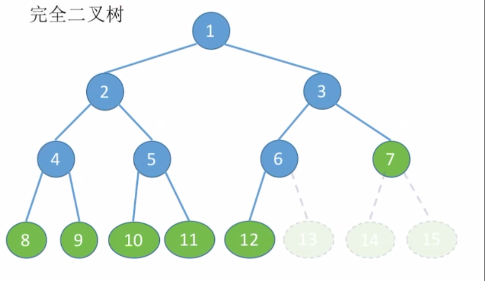

   > **特点**：
   > $\circ$ 只有**最后两层**可能有叶子结点。
   > $\circ$ 最多只能有**一个**度为1的结点。
   > $\circ$ 对于序号为$i$的结点，当$i\le{\lfloor{n/2}\rfloor}$时，该结点为**分支结点**；$i\gt{\lfloor{n/2}\rfloor}$时，该结点为**叶子结点**。
   > $\circ$ 完全二叉树中，如果某个结点只有一个孩子，那么一定是**左孩子**（否则序号一定不匹配）。
3. **二叉排序树**：一棵具有如下性质的二叉树： $\circ$ **左子树**上的所有结点的关键字均**小于**根结点的关键字。 $\circ$ **右子树**上的所有结点的关键字均**大于**根结点的关键字。 $\circ$
   左子树和右子树又各是一棵二叉排序树。
   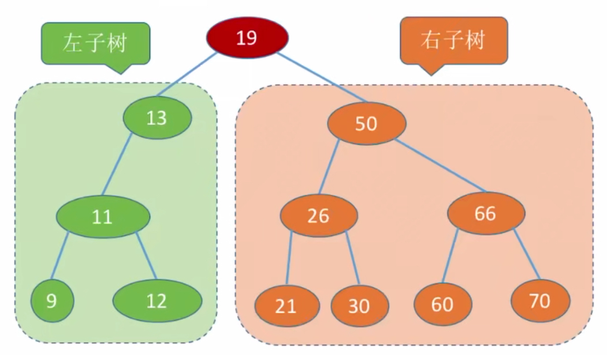
4. **平衡二叉树**：树上任一结点的左子树和右子树的**深度之差**不超过1。
   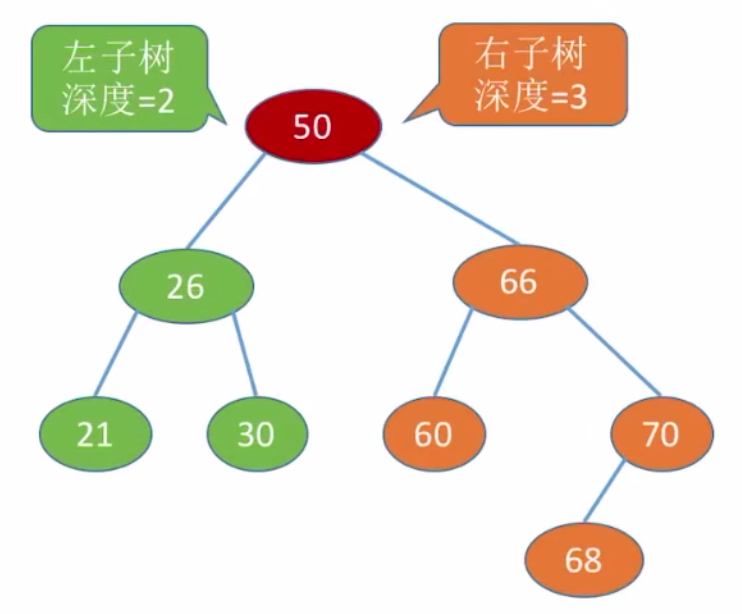

#### 二叉树的性质

$\circ$ 设非空二叉树中度为0、1和2的结点个数分别为$n_0, n_1, n_2$，则 $n_0=n_2+1$，即叶子结点比二分支结点多一个。
$\circ$ 具有$n$个结点的完全二叉树的**高度**$h=\lceil{\log_2(n+1)}\rceil$ 或 $\lfloor{\log_2{n}}+1\rfloor$。
$\circ$ 对于完全二叉树，设度为0、1和2的结点个数分别为$n_0, n_1, n_2$，若其有$2k$个结点（结点数为偶数），则 $n_1=1, n_0=k, n_2=k-1$；若其有$2k-1$个结点（结点数为奇数），则 $n_1=0, n_0=k, n_2=k-1$。

#### 二叉树的存储结构

##### 顺序存储

定义一个数组来存储二叉树中的结点，为了表明二叉树的结构，必须把结点的下标和完全二叉树的下标一一对应起来。
这部分没有代码。

``` c
/* 二叉树的顺序存储 */
#define MAXSIZE 100
typedef ElemType SqBiTree[MAXSIZE];     // 结点数组，可以从0开始存储也可以从1开始（后者的下标和编号一致）
```

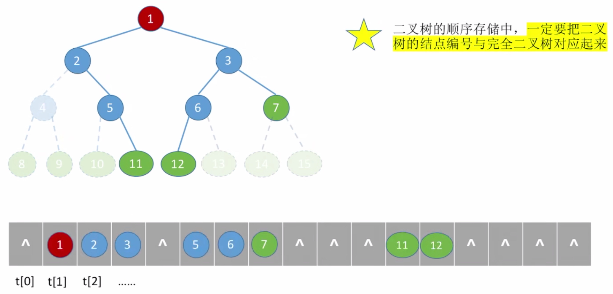

由上图可知，这种存储方法在存储**非完全二叉树**时会有很大的浪费，所以基本不会使用。

##### 链式存储

按照二叉树的结构可以设计出对应的链表结点，包括**二叉链表**和**三叉链表**。
**二叉链表**表示结点中包含两个指针域，分别指向该结点的**左右孩子**；
**三叉链表**除左右孩子外，还包含一个指针域指向该结点的**双亲结点**。 目前常用的是二叉链表。
代码见[BinaryTree.c](https://github.com/Marionette-yixuan/408_Data_Structure/blob/36d4bb2e40013d65d124eec9e03b1574f04e8078/Tree/BinaryTree/BinaryTree.c)。

``` c
/* 二叉树的链式存储 */
typedef struct BiTNode {
  ElemType data;        // 结点的数据域
  struct BiTNode *lchild, *rchild;    // 左孩子指针、右孩子指针
} BiTNode, *BiTree;
```

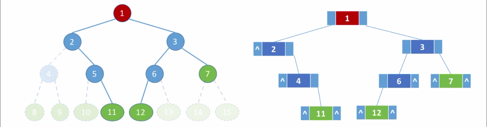

由于并非每个结点都有两个孩子，所以这种存储方式依旧会导致少量资源浪费。
假设二叉树中共有$n$个结点，则一共有$n-1$条边，存储时会用到$2n$个指针域，二者相减可知有$n+1$个指针域是**空链域**。
这部分指针域会在下面的[线索二叉树](#线索二叉树)部分进行进一步使用。

#### 二叉树的遍历

二叉树的遍历是指按照某条搜索路径寻访树中的某个结点，使得每个结点均被访问一次，而且仅被访问一次。
二叉树的几种遍历方式：**先（根）序遍历**、**中（根）序遍历**、**后（根）序遍历**、**层序遍历**。
由于遍历的本质都是访问一遍所有结点，所以无论哪一种方式，时间复杂度都为$O(n)$。

##### 先序遍历 `PreOrderTraverse(BiTree T, void Print(ElemType))`

若二叉树为空，则为空操作，否则：
$\circ$ 访问根结点，
$\circ$ **先序遍历**左子树，
$\circ$ **先序遍历**右子树。
按**根$\rightarrow$左$\rightarrow$右**的顺序遍历。

##### 中序遍历 `InOrderTraverse(BiTree T, void Print(ElemType))`

若二叉树为空，则为空操作，否则：
$\circ$ **中序遍历**左子树，
$\circ$ 访问根结点，
$\circ$ **后序遍历**右子树。
按**左$\rightarrow$根$\rightarrow$右**的顺序遍历。

##### 后序遍历 `PostOrderTraverse(BiTree T, void Print(ElemType))`

若二叉树为空，则为空操作，否则：
$\circ$ **中序遍历**左子树，
$\circ$ **后序遍历**右子树，
$\circ$ 访问根结点。
按**左$\rightarrow$右$\rightarrow$根**的顺序遍历。

##### 层序遍历 `LayerOrderTraverse(BiTree T, void Print(ElemType))`

层序遍历和上述三种遍历方法都不同，而是从树根开始，一层一层访问所有结点，
实现的思路也从递归（**栈式实现**）转为**队列式实现**。步骤如下：
$\circ$ 初始化一个辅助队列，
$\circ$ 根结点入队，
$\circ$ 队列不为空时，让队头结点出队并访问，然后按左孩子、右孩子（如果不为空的话）的顺序入队，
$\circ$ 重复上一步，直到队列为空，遍历完成。

##### 通过遍历序列确定二叉树

通过四种遍历结果的两两组合，可能能够推断出二叉树的确定结构。具体的推导步骤**只可意会、不可言传**。
唯一能够清楚表达的是两两组合中必须包含**中序遍历的序列**，其它三种方式两两组合均不能推断出唯一确定的二叉树结构。

---
### 线索二叉树

当以二叉链表作为存储结构时，之恩能够找到结点的左、右孩子信息，而**不能直接得到结点在任一序列中的前驱和后继信息**。再加上二叉链表中本就有$n+1$个指针域时空链域，所以提出如下规定：
若结点有左子树，则其`lchild`域指示其左孩子，否则令`lchild`域指示其**前驱**；若结点有右子树，则其`rchild`域指示其右孩子，否则令`rchild`域指示其**后继**。
根据上述规定，在二叉链表中增加两个标志位`ltag`和`rtag`，含义如下：
$$ltag=\begin{cases}
0\quad lchild\ 域指示的是结点的左孩子 \\
1\quad lchild\ 域指示的是结点的前驱
\end{cases} \\
rtag=\begin{cases}
0\quad rchild\ 域指示的是结点的右孩子 \\
1\quad rchild\ 域指示的是结点的后继
\end{cases}$$
以这种结点结构作为存储结构的二叉树叫做**线索二叉树**，其中，**线索**指的是指向结点**前驱和后继**的指针。
对二叉树以某种次序遍历使其变为线索二叉树的过程叫做**线索化**。
代码见[BinaryThreadTree.c](https://github.com/Marionette-yixuan/408_Data_Structure/blob/40ba9c4a958189bc6d3f92f96f448e6d94a6515f/Tree/BinaryThreadTree/BinaryThreadTree.c)。
``` c
/* 中序线索二叉树 */
typedef struct InBiTNode {
  ElemType data;
  struct InBiTNode *lchild, *rchild;
  int ltag, rtag;
} InBiTNode, *InBiTree;
```
线索二叉树这部分在课内讲的时候使用了头结点，但在网课和考研中好像并不要求，因此后面先整理了不带头结点的方式。

#### 中序线索二叉树

所谓中序线索二叉树，就是通过**中序遍历**来对一棵二叉树进行线索化。即每个结点若`tag == 1`，则对应的孩子指向该结点在中序遍历中的前驱/后继。

##### 中序线索化 `InThreading (InBiTree T)`

三种线索化中，都要设置一个全局指针`pre`指向遍历过程中访问的**上一个结点**，用于指针的回指，初始化`pre = NULL`。
设当前线索化的子树为`T`，关键步骤：
$\circ$ 左子树线索化，
$\circ$ 若`T`没有左孩子，则将左链域指向`pre`，并将`ltag`置1，
$\circ$ 若`pre`没有右孩子，则将`pre->rchild`指向`T`，并将`pre->rtag`置1，
$\circ$ 右子树线索化。

##### 中序线索二叉树的遍历 `InThreadTraverse (InBiTree T)`

中序遍历时，遍历任意一棵子树`T`时，一定是从`T`最**左下**的结点开始遍历。
按照这种思路，针对线索二叉树设计如下**非递归**的遍历方法：
$\circ$ 设置结点指针`current_node`指向`T`，然后进入循环，
$\circ$ 每次循环中首先找到子树`T`的最**左下**结点，进行访问
$\circ$ 如果该结点**没有**右子树（`rtag == 1`），说明它的右孩子指向**遍历的下一个结点**，则直接依次将`current_node`指向右孩子结点并访问即可，直到访问的结点右子树**不为空**。
$\circ$ 当`current_node`的右子树不为空时，以`current_node->rchild`作为新的子树进行下一次循环即可。

##### 中序前驱&中序后继

这里的前驱和后继是在已经进行过线索化的情况下快速找到的，可以在遍历操作中使用。
**结点`T`的中序前驱**：
$\circ$ 如果`T->ltag == 1`，说明左孩子域指向的直接就是前驱结点，返回`T->lchild`即可，
$\circ$ 否则说明`T`有左孩子，则它的前驱应该是**左子树的最右下结点**。

**结点`T`的中序后继**：
$\circ$ 如果`T->rtag == 1`，说明左右孩子域指向的直接就是后继结点，返回`T->rchild`即可，
$\circ$ 否则说明`T`有右孩子，则它的后继应该是**右子树的最左下结点**。

#### 先序线索二叉树

即用先序遍历来进行线索化的二叉树。

##### 先序线索化 `PreThreading (PreBiTree T)`

设当前线索化的子树为`T`，关键步骤：
$\circ$ 若`T`没有左孩子，则将左链域指向`pre`，并将`ltag`置1，
$\circ$ 若`pre`没有右孩子，则将`pre->rchild`指向`T`，并将`pre->rtag`置1，
$\circ$ 左子树线索化，
$\circ$ 右子树线索化。

##### 先序线索二叉树的遍历 `PreThreadTraverse (PreBiTree T)`

先序遍历的顺序是**根$\rightarrow$左$\rightarrow$右**，故在访问完根结点`T`后，要判定`T`是否有左子树。步骤如下：
$\circ$ 设置结点指针`current_node`指向`T`，然后进入循环，
$\circ$ 访问`current_node`，
$\circ$ 若`current_node->rtag == 1`，说明当前结点的右孩子直接指向后继结点，设置`current_node = current_node->rchild`，然后访问即可，
$\circ$ 否则判定`current_node`是否有左子树。若有，则**左子树的树根**为后继结点；若没有，则**右子树的树根**为后继结点。

##### 先序后继

对于结点`T`，当`T->rtag == 1`时，说明`T->rchild`即为先序遍历中`T`的后继结点，
否则若`T->ltag == 0`，说明`T`同时有左右子树，则**左子树的树根**为后继结点，
否则说明`T`只有右子树，则**右子树的树根**为后继结点。

先序线索二叉树**无法**通过算法确定某个结点的前驱结点，故只能在**遍历**中得到前驱结点的信息。

#### 后序线索二叉树

即用后续遍历来进行线索化的二叉树。

##### 后序线索化 `PostThreading(PostBiTree T)`

设当前线索化的子树为`T`，关键步骤：
$\circ$ 左子树线索化，
$\circ$ 右子树线索化,
$\circ$ 若`T`没有左孩子，则将左链域指向`pre`，并将`ltag`置1，
$\circ$ 若`pre`没有右孩子，则将`pre->rchild`指向`T`，并将`pre->rtag`置1。

##### 后序前驱

对于结点`T`，当`T->ltag == 1`时，说明`T->lchild`即为后序遍历中`T`的前驱结点，
否则若`T->rtag == 0`，则说明`T`有右子树，则**右子树的树根**为前驱结点，
否则说明`T`的右子树为空，则**左子树的树根**为前驱结点。

后序线索二叉树**无法**通过算法确定某个结点的后继结点，因此非递归的遍历操作也很（mei）难（fa）完成。

---
### 树和森林

#### 树的存储结构

##### 双亲表示法

用一组**连续空间**存储树的结点，同时在每个结点中附设一个`int`型变量指示双亲在数组中的位置。
代码见[TreeStoreStructure.c](https://github.com/Marionette-yixuan/408_Data_Structure/blob/facae65b7c790d22b6e0df4c421b679c467124c9/Tree/TreeStoreStructure/TreeStoreStructure.c)（记得将.h文件的14行的宏定义改为`PARENT_MODE`）。
``` c
/* 双亲表示法 */
typedef struct {
  ElemType data;        // 数据域
  int parent;           // 双亲的位置
} PTNode;
typedef struct {
  PTNode nodes[MAX_TREE_SIZE];  // 树中全部结点的存储域
  int nodeNum;          // 结点数
} PTree;
```
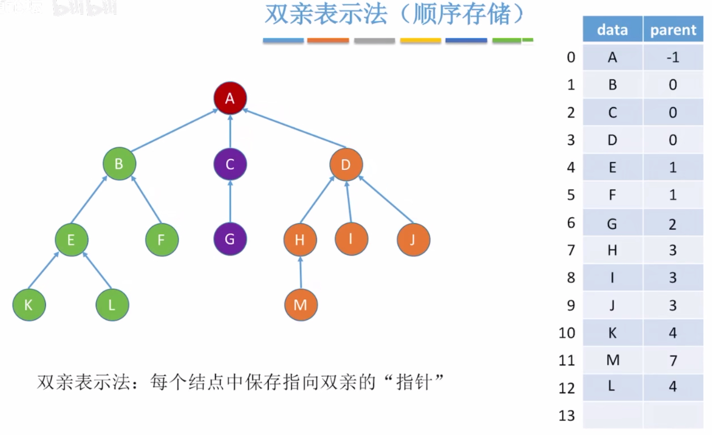

###### 插入操作 `AddNode(PTree *pTree, ElemType newData, int parent)`

插入操作比较简单，只需要新创建一个结点存储`newData`和其双亲的位置`parent`，然后将这个结点放置在数组末尾即可。

###### 删除操作 `DeleteNode(PTree *pTree, int index)`

删除操作时，为了保证数组的有效数据都在**最前方**，删除一个结点后要用后方的结点填充这个空位，具体操作就是把最后一个结点移到删除结点的位置上。
另外，如果删除结点`T`的不是叶子结点，还需要遍历整个表，**递归删除**以`T`为双亲的所有结点。

从以上定义和操作不难看出，双亲表示法的**优点**在于查找指定结点的双亲比较方便，**缺点**是找某结点的孩子只能从头遍历。

##### 孩子表示法

用连续的空间来存储每个结点的信息，并在每个结点中附设一个指针域`*firstChild`来指向一个依次存储该结点所有孩子的**链表**。
代码见[TreeStoreStructure.c](https://github.com/Marionette-yixuan/408_Data_Structure/blob/facae65b7c790d22b6e0df4c421b679c467124c9/Tree/TreeStoreStructure/TreeStoreStructure.c)（记得将.h文件的14行的宏定义改为`CHILD_MODE`）
``` c
/* 孩子表示法 */
struct CTNode {
  int child;                // 孩子结点在数组（nodes）中的位置
  struct CTNode *next;      // 下一个孩子
};
typedef struct {
  ElemType data;
  struct CTNode *firstChild;    // 第一个孩子
} CTBox;
typedef struct {
  CTBox nodes[MAX_TREE_SIZE];
  int nodeNum, rootPos;         // 结点个数、根的位置
} CTree;
```


###### 插入操作 `AddNode(CTree *cTree, ElemType newData, int parent)`

孩子表示法的插入操作比双亲表示法要麻烦一些，关键步骤如下：
$\circ$ 在数组`nodes`中找到第一个空位`i`，在这个位置存入新数据，并将`firstChild`置为`NULL`，
$\circ$ 找到`parent`位置的双亲结点，循环找到孩子链表的最后一位（需要先判定`firstChild`是否为空），新建结点将`i`存储进去。

###### 删除操作 `DeleteNode(CTree *cTree, int index)`

删除操作和双亲表示法差不多，但由于找孩子时并不用遍历整个数组，所以也不用将数组后方的结点移到前面来了。关键步骤如下：
$\circ$ 找到`nodes[index]`的孩子链表，递归删除每一个子树，
$\circ$ 将`nodes[index]`位置的数据初始化，表示删除这个结点了，
$\circ$ 结点数`nodeNum--`。

##### 孩子兄弟表示法
孩子兄弟表示法是一种纯**链式**的表示方法，将每个结点设计成存储**第一个孩子**和**下一个兄弟**两个指针来记录二叉树的结构。
按照这样的设计，将第一个孩子看作**左子树**，下一个兄弟看作**右子树**，可以将**任何树转化为二叉树**的形式。
这部分没有代码（写了一下午发现插入和删除操作实在很难用代码实现）。
``` c
/* 孩子兄弟表示法 */
typedef struct CSNode {
  ElemType data;
  struct CSNode *firstChild, *nextSib;    // 第一个孩子 & 下一个兄弟指针
} CSNode, CSTree;
```
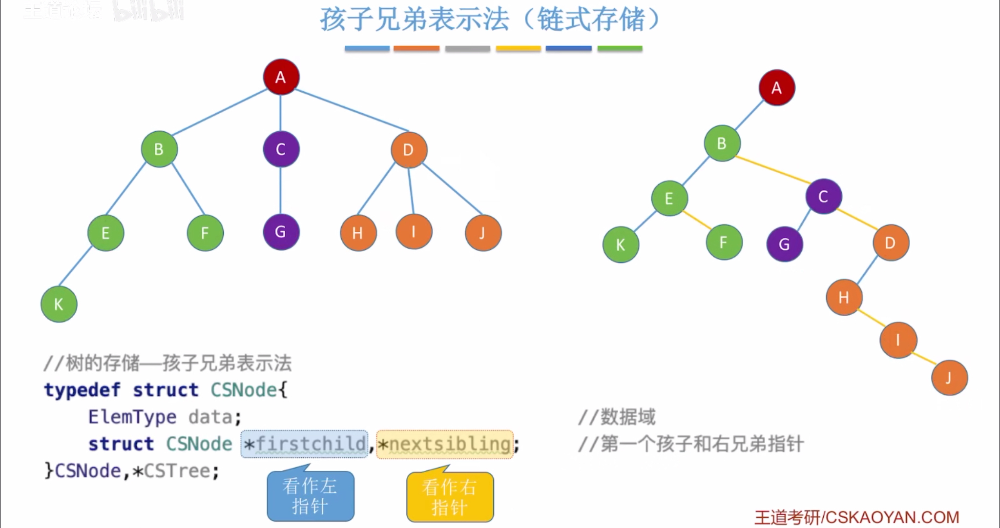

#### 树、森林和二叉树的转换

上一部分提到了使用**孩子兄弟表示法**可以将任意一棵树转换为二叉树，且转换后的二叉树树根必然**没有右孩子**。因此，对于森林来说，可以将其中的每一棵树依次转换为二叉树，然后树根依次以右孩子相连，即完成了森林与二叉树的转换。
代码见[TreeConversion.c]()。

##### 树$\rightarrow$二叉树 `BiTree TrToBi(TrTree trTree)`

写完之后发现写成代码比手算要复杂很多，简单说一下步骤：
1 创建根结点，存储当前树的树根信息，
2 转换**第一棵**子树，将转换结果连接到根结点的**左子树**位置，
3 依次转换剩余子树，将转换结果依次连接到上一个结果的**右子树**位置，
4 返回转换后的树，用作上级的连接。
