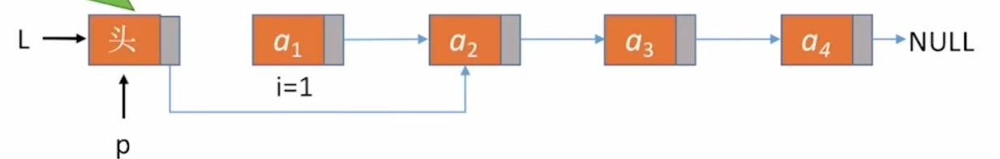
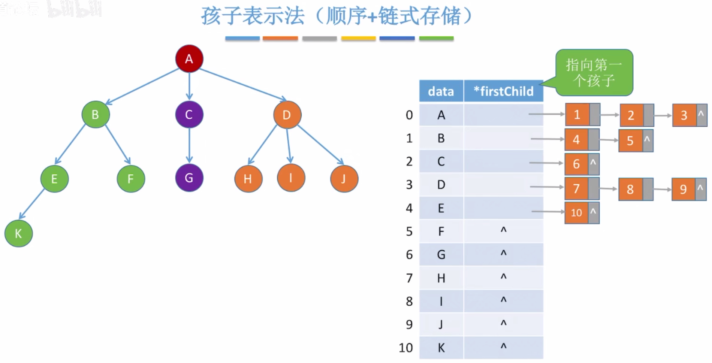
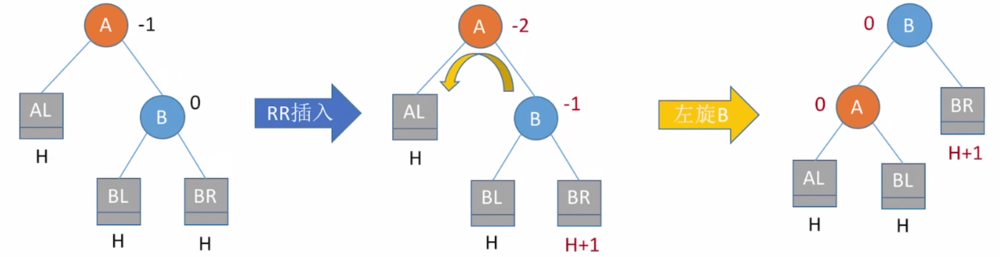
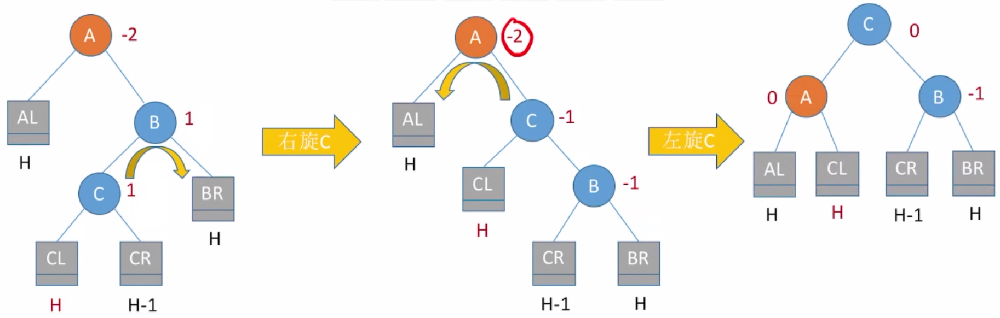

<font face="Source Code Pro"/>

[toc]

## 绪论

### 基本概念

- **数据**是对客观事物的符号表示，在计算机科学中是指所有能输入到计算机中并被计算机程序处理的符号的总称。
- **数据元素**是数据的基本单位，在计算机程序中通常作为一个整体进行考虑和处理。
- 一个数据元素可由若干个**数据项**组成。数据项是数据不可分割的最小单位。
- **数据对象**是性质相同的数据元素的集合，是数据的一个子集。

> 图书馆里的所有书的书目信息可以看作一个数据；
> 某一本书的书目信息就是一个数据元素；
> 这本书的书名、作者名、出版时间等就是一个数据项。

#### 数据结构

**数据结构**是相互之间存在一种或多种特定关系的数据元素的集合。数据元素之间的关系称为**结构**。
> **数据对象**不强调元素之间的关系，**结构**强调的是元素之间的关系。

##### 四类基本结构

- **集合**：元素之间除同属一个集合外无其他关系。
- **线性结构**：元素之间存在**一对一**的关系。即除第一个元素外，每个元素都有唯一前驱；除最后一个元素外，每个元素都有唯一后继。
- **树形结构**：元素之间存在**一对多**的关系。
- **图状结构**（无向）或**网状结构**（有向）：元素之间存在**多对多**的关系。

数据结构的三要素：**逻辑结构**、**物理结构**、**运算方法**。

- **逻辑结构**：[结构](#数据结构)定义中的“关系”描述的是数据元素之间的逻辑关系，所以又叫**逻辑结构**。
- **物理结构**：数据结构在计算机中的表示（又称映像）称为数据的**物理结构**，又称**存储结构**。
  > 存储结构会影响：1. 存储空间分配的方便程度&nbsp;&nbsp;2. 数据的运算速度
  - **顺序存储**：逻辑上相邻的元素在物理上也相邻。元素间关系用存储单元的**邻接关系**来体现。
  - **链式存储**：逻辑上相邻，物理上不一定相邻。由**指针**来表示元素间的关系。
  - **索引存储**：建立附加的索引表来保存数据的**关键字**和**存储地址**。
  - **散列存储**：根据元素的关键字**计算出**存储地址，又叫哈希存储。

#### 数据类型

**数据类型**是一个**值的集合**和定义在这个值集上的**一组操作**的总称，包括非结构的**原子类型**（如整型、字符型、指针类型、空类型等）和**结构类型**。

##### 抽象数据类型

**抽象数据类型**是指一个数学模型以及定义在该模型上的一组操作。 抽象数据类型的定义仅取决于它的一组**逻辑特性**，而与其在计算机内部如何表示和实现无关。

---

### 算法和算法分析

**算法**是对特定问题求解步骤的一般描述，它是指令的有限序列，其中每一条指令表示一个或多个操作。 算法具有以下5个重要特性：

1. **有穷性**：一个算法总是在执行**有穷步**后结束，且每一步可在**有穷时间**内完成。

   > 算法必须是有穷的，程序可以是无穷的。
2. **确定性**：对于相同的输入只能得出相同的输出。
3. **可行性**：算法中描述的操作都是可以通过已经实现的基本运算执行有限次来实现的。
4. **输入**：一个算法有**零个或多个**输入。
5. **输出**：一个算法有**一个或多个**输出。

#### 算法复杂度

算法中基本操作重复执行的次数是问题规模 $n$ 的某个函数 $f(n)$，算法的时间量度记作 $T(n)=O(f(n))$，表示随问题规模 $n$ 的增大，算法执行时间的增长率和 $f(n)$ 的增长率相同，$T(n)$ 称作算法的**渐进时间复杂度**，简称**时间复杂度**。

**算法复杂度排序**：$O(1)\lt O(\log{n})\lt O(n)\lt O(n\log{n})\lt O(n^2)\lt O(n^3)\lt O(2^n)\lt O(n!)\lt O(n^n)$
**加法规则**：$O(f(n))+O(g(n))=O(\max\{f(n), g(n)\})$
**乘法规则**：${O(f(n))}\times{O(g(n)})=O({f(n)}\times{g(n)})$
> 计算算法复杂度时，只保留次数最大项的一倍结果即可，且一般只考虑**平均**或**最差**时间复杂度。

---
---

## 线性表

**线性表**是具有**相同数据类型**的 $n$ 个数据元素的**有限**序列，其中 $n$ 为表长，当 $n=0$ 时线性表是一个**空表**。若将线性表记为 $(a_1, \dotsc, a_{i-1}, a_i, a_{i+1}, \dotsc, a_n)$，则称 $a_{i-1}$ 是 $a_i$ 的直接**前驱**元素，$a_{i+1}$ 是 $a_i$ 的直接**后继**元素，$i$ 为元素 $a_i$ 在线性表中的**位序**。
> **下标**是从0开始的，**位序**是从1开始的。

---

### 顺序表

线性表的顺序表示是指用一组**地址连续**的存储单元依次存储线性表的数据元素，即逻辑上相邻的元素物理存储上也相邻。
代码见[SqList.c](https://github.com/Marionette-yixuan/408_Data_Structure/blob/4c89d55ff33ef09fb5020dc81f9d692865706787/List/SqList/SqList.c)。

``` c
/* 线性表 */
#define LIST_INIT_SIZE 100      // 线性表存储空间的初始分配量
#define LISTINCREMENT 10        // 存储空间的分配增量

typedef struct {
  ElemType *elem;               // 存储空间的基址
  int length;                   // 当前线性表的长度
  int listsize;                 // 当前分配的存储容量（当前表的最大容量）
} SqList;
```

顺序表的特点：

- **随机访问**，即可以在 $O(1)$ 时间内找到第 $i$ 个元素。
- **存储密度高**，每个结点只存储数据元素。
- **拓展容量不方便**，必须要重新分配地址空间，然后迁移数据。
- **插入、删除操作不方便**，需要移动大量元素。

#### 顺序表的插入和删除

##### 插入操作 `ListInsert_Sq(SqList *L, int i, ElemType e)`

插入操作基本流程：

1. 判定插入位置i是否合法：i的合法范围为**1~L.length+1**。
2. 判定当前表是否已满。若已满，则需要增加表长、重新分配存储空间，然后迁移数据。
3. 获取插入位置的元素：L.elem[i-1]。
4. **从后往前**依次将插入位置（**含**）之后的元素**后移**。
5. 将新元素e插入表中。
6. 增加表长 L.length++。

时间复杂度：

- 最好情况：插入到**表尾**，不需移动元素，时间复杂度为 $O(1)$。
- 最坏情况：插入到**表头**，需要移动所有元素，时间复杂度为 $O(n)$。
- 平均情况：插入到各个位置的概率相同，时间复杂度为 $O(\frac{n}{2})=O(n)$。

##### 删除操作 `ListDelete_Sq(SqList *L, int i, ElemType *e)`

删除操作基本流程：

1. 判断删除位置i是否合法：i的合法范围为**1~L.length**。
2. 获得删除位置的元素：L.elem[i-1]。
3. **从前往后**依次将删除位置（**不含**）之后的元素**前移**。
4. 减少表长 L.length--。

时间复杂度：

- 最好情况：删除表尾元素，不需移动元素，时间复杂度为 $O(1)$。
- 最坏情况：删除表头元素，所有元素都需要前移，时间复杂度为 $O(n)$。
- 平均情况：插入到各个位置的概率相同，时间复杂度为 $O(\frac{n-1}{2})=O(n)$。

即在顺序存储结构的线性表中插入或删除一个数据元素，平均约移动表中**一半**的元素。

---

### 链表

线性表的链式存储结构是用一组**任意的**存储单元存储线性表的数据元素（可连续也可不连续）。 因此除了存储本身的数据信息外，还需要存储其直接后继的存放位置。这两部分信息共同构成一个**结点**，结点中存储数据信息的域叫做**数据域**
，存储直接后继信息的域叫做**指针域**。

链表的特点：

- 不要求大量**连续的**存储空间，改变容量方便。
- 不可随机存取，必须从首结点一路向下找到目标结点。
- 需要耗费一定空间用作指针域。
- 插入、删除元素操作简单。

#### 单链表

单链表是指指针域只有**一个**指向后继元素的指针的链表。
代码见[LkList.c](https://github.com/Marionette-yixuan/408_Data_Structure/blob/4c89d55ff33ef09fb5020dc81f9d692865706787/List/LkList/LkList.c)。

``` c
/* 单链表 */
typedef struct LNode {
  ElemType data;            // 数据域
  struct LNode *next;       // 指针域
} LNode, *LinkList;        // LNode强调结点本身，LinkList强调整个链表的指针
```

##### 实现方式

单链表有两种实现方式：带头结点&不带头结点。**头结点**是指一个数据域为空（也可以存储如表长之类的数据）、指针域指向整个链表第一个结点（**首结点**）的结点。两种实现方法的差异主要在**初始化**和**判空**的操作上。

- 不带头结点：不带头结点时，指向单链表的指针L（**头指针**）直接指向**首结点**。
  **初始化**方法：`L = NULL`，代表表中没有结点；
  **判空**方法：`L == NULL`，即头指针为空则说明表空。
  不带头结点时，在链表头部插入和删除元素时都需要更改头指针，不太方便。

- 带头结点：带头结点时，头指针L指向**头结点**。
  **初始化**方法：申请一片空间给头结点`head_node`，随后头指针`L`指向头结点、头结点的指针域置NULL。
  **判空**方法：`L.next == NULL`。L指向的是头结点，头结点没有后继元素代表链表为空。

判断结点p是否为表尾的操作（两种实现方法相同）：`p.next == NULL`
由于带头结点的单链表显然更加常用，所以以下操作均为带头结点的实现方法。

##### 插入操作 `ListInsert_Lk(LinkList L, int i, ElemType e)`

假设要插入的元素e存放在名为**s**的结点指针中，表中插入位置i的**上一个结点**的指针为**p**（即s结点插入到p的后侧），则关键步骤如下：

1. `s->next = p->next`，p原本的后继元素变为s的后继元素。
2. `p->next = s`，p的新后继元素为s。
   

两步的顺序十分重要，不能颠倒！

时间复杂度：$O(n)$

> 指定结点**p**的**前插**操作：
> 方法一：从头结点找到p的前驱结点，进行插入。时间复杂度：$O(n)$
> 方法二：新建一个结点s插入到p后方，然后把p的数据内容复制到s中，随后用新元素e替换p中元素。时间复杂度：$O(1)$
> | s->next = p->next;
> | p->next = s;
> | s->data = p->data;
> | p->data = e;

##### 删除操作 `ListDelete_Lk(LinkList L, int i, ElemType *e)`

假设要删除结点（第i个结点）的**上一个结点**的指针为**p**（即删除p的下一个结点，设为**q**），则关键步骤如下：

1. `p->next = q->next`，p的新后继元素为要删除结点(q = p->next)的后继元素。
2. `free(q)`，释放q的存储空间，交还操作系统。
   

时间复杂度：$O(n)$

> 指定结点**p**的删除操作：
> 令**q**指向**p**的后一个结点，将q的数据域和指针域复制到p中，随后删除q结点。
> | q = p->next;
> | p->data = q->data;
> | p->next = q->next;
> | free(q);
> 除最后一个结点外都可以这样进行删除。时间复杂度：$O(1)$

单链表的局限性：**无法逆向检索**，要找到某个结点的前驱必须要从头结点进行遍历，花$O(n)$的时间复杂度。

#### 双链表

为了解决单链表无法逆向搜索的弊端，在指针域添加一个指向**前驱元素**的指针。牺牲少量存储密度换来更快捷的操作。
代码见[DuList.c](https://github.com/Marionette-yixuan/408_Data_Structure/blob/b7b40eaecb6fea49799191603d2131747b1fd70d/List/DuList/DuList.c)。

``` c
/* 双链表 */
typedef struct DNode {
  ElemType data;
  struct DNode *prior;    // 前驱指针域
  struct DNode *next;     // 后继指针域
} DNode, *DoubleList;
```

##### 初始化&判空（默认带头结点）

初始化时，申请一片内存空间用来存放头结点`head_node`，并将`head_node`的**前驱**和**后继指针域**置为NULL，随后双链表指针指向头结点。在后续操作中，头结点的前驱指针域**始终为NULL**。后继指针域指向首结点。
判空操作与单链表相同，`L->next == NULL`，即根据头结点的后继指针是否为NULL来判定。

##### 插入操作 `ListInsert_Du(DoubleList D, int i, ElemType e)`

假设要插入的元素e存放在名为**s**的结点指针中，表中插入位置i的**上一个结点**的指针为**p**（即s结点插入到p的后侧），则关键步骤如下：

1. `s->next = p->next`，同单链表。
2. `p->next->prior = s`，将原表中p的后继结点的前驱域（原本指向p）指向s。
3. `s->prior = p`，p为s的前驱。
4. `p->next = s`，同单链表。
   

其中，2/3步的位置可以互换，其余两步位置固定。
第2步中，若插入在最后一个结点后方，可能会出现空指针的错误，所以要先判断`p->next == NULL`，即p有无后继结点。
对于前插操作，只需要找到i位置结点的前一个结点，再进行后插操作即可。

##### 删除操作 `ListDelete_Du(DoubleList D, int i, ElemType *e)`

假设要删除结点（第i个结点）的**上一个结点**的指针为**p**（即删除p的下一个结点，设为**q**），则关键步骤如下：

1. `p->next = q->next`，同单链表。
2. `q->next->prior = p`，p为原本q的后继结点的前驱。
3. `free(q)`，释放空间。
   

同样，第2步可能会出现空指针的错误，需要进行判断。

#### 循环链表

循环链表分为循环单链表和循环双链表，其最大的特征是尾结点的后继指针不为NULL。

##### 循环单链表

循环单链表中，**尾结点的后继指针域回指向头结点**，而普通单链表的尾结点后继指针域则为NULL。
> 循环链表可以从任意一个结点出发，向后遍历找到任意一个结点。

代码见[CrList.c](https://github.com/Marionette-yixuan/408_Data_Structure/blob/80dbb854256203134a2307fb771bf9a23519117d/List/CrList/CrList.c)


###### 初始化&判空&判表尾

- **初始化**：头结点`head_node`的指针域应指向头结点本身，即`head_node->next = head_node`。其余与单链表相同。
- **判空**：循环链表`C`为空的条件为`C->next == C`，即头结点的指针域指向自己。
- **判表尾**：结点`p`为循环链表`C`的表尾元素的条件为`p->next == C`，即指针域指向头结点。

###### 尾指针

由于对链表的很多操作都是在表头或者表尾进行，而从**头指针找到尾部**需要$O(n)$的时间复杂度，所以在循环链表中，可以不设头指针而改用**尾指针**，由**尾指针找到头部**只需要$O(1)$的时间复杂度，大大简化。当然，需要在**表尾**插入和删除元素时需要修改尾指针的值。

##### 循环双链表

循环双链表在循环单链表的基础上，**尾结点的后继指针域指向头结点、头结点的前驱指针域指向尾结点**，与之相对的双链表的上述两个指针域均为NULL。 这部分没有代码。


###### 初始化&判空&判表尾

- **初始化**：头结点`head_node`的前驱指针域和后继指针域均指向自己。
- **判空**：循环链表`C`为空的条件为`C->next == C`或`C->prior == C`，即头结点的两个指针域均指向自己。
- **判表尾**：结点`p`为循环链表`C`的表尾元素的条件为`p->next == C`，即指针域指向头结点。

##### 循环链表的插入和删除

在双链表的插入和删除操作（见[双链表](#插入操作-listinsert_dudoublelist-d-int-i-elemtype-e)）中，需要判定操作位置是否为表尾，否则会出现空指针异常。而在循环链表中由于表尾元素的后继指针域不为NULL，所以无需进行判定，直接进行操作即可。

#### 静态链表

分配一整片连续的内存空间，每个内存单元中存放一个链表的结点，如下图。


- 优点：增删操作不需要移动大量元素
- 缺点：不能随机存取，查找需要从头遍历元素。容量**固定不可变**。

适用场景：不支持指针的低级语言；数据元素数量固定不变的场景（如OS的文件分配表FAT）。 这部分没有代码。

``` c
/* 静态链表 */
#define MaxSize 10  // 静态链表的最大长度
typedef struct {
  ElemType data;    // 静态链表结构类型的定义
  int next;         // 下一个元素的数组下标
} SLinkList[MaxSize];   // SLinkList直接就是数组类型
```

##### 基本操作的实现方法

- **查找**：从头结点出发遍历后序结点（$O(n)$）
- **插入**第i个位置：
  1. 在表的内存空间中找到一个空（需预先设置**空结点**的特征，如`next = -2`）的结点`s`，存入数据
  2. 查找第i-1个结点`p`
  3. `s->next = p->next`
  4. `p->next = s`
- **删除**i位置的结点：
  1. 查找第i-1个结点`p`和第i个结点`q`
  2. `p->next = q->next`
  3. `q->next = -2`，表示这个结点为空了

---
---

## 栈和队列

### 栈

栈是限定仅在**表尾**进行插入或删除操作的**线性表**，栈的表尾被称作**栈顶**、表头端称为**栈底**。 栈的特点就是**后进先出**（**LIFO**），后压入栈的元素会先出栈。

栈最重要的两个操作:

- **压栈**（**Push**）：将一个元素放置在栈顶。
- **弹栈**（**Pop**）：将栈顶元素取出。

#### 合法出栈序列

若有$n$个元素依次进栈，则有 $\frac{1}{n+1}\mathrm{C}^n_{2n}$ 种合法的出栈序列。 其中，若元素以 $\cdots{A}\cdots{B}\cdots{C}\cdots$ 的顺序入栈，则**不可能**出现 $\cdots{C}\cdots{A}\cdots{B}\cdots$ 的出栈序列。

#### 顺序栈

**顺序栈**就是利用一组地址连续的存储单元依次存放自栈底到栈顶的数据元素，同时附设**top指针**指示栈顶元素在顺序栈中的位置。
代码见[SqStack.c](https://github.com/Marionette-yixuan/408_Data_Structure/blob/60da0b8eccf94b4c216f3267cb0d16a21454227a/Stack/SqStack/SqStack.c)。

``` c
/* 顺序栈 */
typedef struct {
  ElemType *base;       // 栈存储空间的基址，指向栈底的位置
  ElemType *top;        // 当前栈顶的地址
  int stack_size;       // 该顺序栈的最大容量
} SqStack;
```

- `base == NULL`说明栈**不存在**。
- `base == top`说明栈中无元素，为**空栈**。
- `top - base >= stack_size`说明栈**已满**。

> 教材上初始时`base == top`，每压入一个元素`top++`，这样会使top始终指向栈顶元素的**下一个位置**。
> 有些题目中会使top指针指向栈顶元素**本身**（王道网课的第一种方式top指针就是指向栈顶本身），记得读题。

##### 压栈操作 `Push(SqStack *S, ElemType e)`

关键步骤：

1. `S->base[top] = e`，将新元素放置在栈顶位置。
2. `S->top++`，栈顶指针增加。

> 如果是使用的第二种实现方法（top直接指向栈顶元素），则需要调换两步的位置，先增加top指针再入栈。

除此之外还要先进行栈满的判断，若已满则要重新分配更大的存储空间。

##### 弹栈操作 `Pop(SqStack *S, ElemType *e)`

关键步骤：

1. `S->top--`，先减少栈顶指针，使其指向栈顶元素。
2. `*e = S->base[top]`，元素出栈。

> 同样如果是使用的第二种实现方法，则先元素出栈再减少栈顶指针。

除此之外还要先进行栈空的判断，若为空则返回错误信息。

##### 共享栈

**共享栈**是顺序栈的一种变体，为两个栈共享同一片连续的内存空间， 栈底分别是内存空间的上下限，两个栈分别向中间生长。 这部分没有代码。

``` c
/* 共享栈：教材上没有这部分的介绍，所以使用了王道书上的定义风格 */
typedef struct {
  ElemType data[MaxSize];     // 静态数组代表连续内存空间
  int top0;                   // 0号栈栈顶指针
  int top1;                   // 1号栈栈顶指针
} ShStack;
```

**初始化**：`top0 = -1`，代表0号栈的栈顶元素在data[-1]（即没有元素）；`top1 = MaxSize`，代表1号栈的栈顶元素在data[MaxSize]（即没有元素）。
> **-1**和**MaxSize**都超出了数组的下标范围，可见这里使用的是第二种实现方式，即top指针直接指向栈顶元素。

**栈满**：`top1 - top0 == 1`，说明top1和top0相邻了，即两个栈生长到同一个位置了。

#### 链栈

**链栈**就是用单链表实现的栈结构，其定义与[单链表](#单链表)相同。其中，头结点的一端用作栈顶，方便操作。对于两种不同实现方式，对应的基本操作也略有不同。

- 不带头结点： 只在**头指针处**进行插入、删除，对应压栈、弹栈操作。
- 带头结点： 只在**头结点后**进行插入、删除，对应压栈、弹栈操作。

代码见[LkStack.c](https://github.com/Marionette-yixuan/408_Data_Structure/blob/60da0b8eccf94b4c216f3267cb0d16a21454227a/Stack/LkStack/LkStack.c)。

#### 栈的应用

这一部分包括括号匹配、中缀表达式转后缀表达式以及后缀表达式求值。
其中括号匹配比较简单，就不给出文字描述了，代码在[LkStackMain.c](https://github.com/Marionette-yixuan/408_Data_Structure/blob/60da0b8eccf94b4c216f3267cb0d16a21454227a/Stack/LkStack/LkStackMain.c)中的`test3_19()`函数中。
另外两个应用的手算方法同样没有技术含量，下面只整理了计算机的处理方法。

##### 中缀表达式转后缀表达式

> 后缀表达式又称**逆波兰表达式**。

转换过程：

1. 初始化一个栈，来保存**不能确定运算顺序**的运算符（能确定的已经加到表达式里了）。
2. 从左到右处理中缀表达式：
    1. 遇到**操作数**：直接加入后缀表达式。
    2. 遇到**界限符**（即 **'('** 和 **')'**）： 遇到'('则直接入栈， 遇到')'则依次弹出栈内所有运算符并加入后缀表达式，直到遇到'('为止，然后将'('弹出但**不加入**表达式。
    3. 遇到**运算符**： 依次弹出栈内所有优先级**高于或等于**当前运算符的所有运算符，并加入后缀表达式。碰到'('或者栈空时停止， 之后将当前运算符入栈。
3. 读入结束后，将栈中剩余符号依次加入后缀表达式。

实例见[InToPost.pdf](https://github.com/Marionette-yixuan/408_Data_Structure/blob/34b23bca6e051bcfca4f051900283e2284972237/z_examples/InToPost.pdf)

##### 计算后缀表达式

计算过程：

1. 初始化一个数值栈，用来存放未参与运算的操作数。
2. 从左到右处理后缀表达式：
    1. 遇到**操作数**：压入数值栈。
    2. 遇到**运算符**：从数值栈中弹出两个操作数（**先弹出的是右操作数**）进行运算，随后将结果压回栈中。
3. 处理完成后，栈中应该只剩下一个操作数，即为结果。

---

### 队列

**队列**是只允许在**一端**进行插入、**另一端**进行删除的线性表。允许入队（插入）的一端称为**队尾**，允许出队（删除）的一端称为**队头**。 队列的特点和栈正相反，为**先进先出**(FIFO)，先入队的元素会先出队。

队列的两个重要操作：

- **入队（EnQueue）**：将一个元素放置在队尾。
- **出队（DeQueue）**：将队头的元素取出。

#### 顺序队列

用顺序存储的方式实现的队列，需要用base指针来指示连续内存空间的基址，以及指示队头和队尾的两个指针front和rear。由于rear和front指针会在连续的内存中循环移动，所以更常见的名称是**循环队列**。
代码见[SqQueue.c](https://github.com/Marionette-yixuan/408_Data_Structure/blob/acb5db88088f6894442ebfe9d8dc650f6d6e84d9/Queue/SqQueue/SqQueue.c)。


``` c
/* 顺序队列 */
#define MAXQSIZE 100
typedef struct {
  ElemType *base;
  int front, rear;
} SqQueue;
```

初始时rear = front = 0，有元素入队则入队后rear++，有元素出队则出队后front++。因此rear始终指向队尾元素的**下一个位置**，而front**直接**指向队头元素（这里需要好好理解一下）。
> 同样，有的题目让rear也**直接**指向队尾元素，此时初始化时`rear = MAXQSIZE - 1`（相当于-1）。下述判空判满的操作也要对应修改。

- `base == NULL`说明队列**不存在**。
- `rear == front`说明队列为**空**。
- `front == (rear + 1) % MAXQSIZE`说明队列**满**，即队尾指针在队头的**上一个位置**。

  > 此时虽然rear指向的那个内存单元没有元素，但也不能使用，否则会出现`rear == front`的情况，误认为队列为空。故这种存储方法，队列中最多存放**MAXQSIZE-1**个元素。

> 能让队列存放MAXQSIZE个元素的方法：
> 在队列的定义中加入一个变量`size`来记录**队列中元素个数**：`size = (rear + MAXQSIZE - front) % MAXQSIZE`。当然，要更改判定队满的条件。
> 加入一个标志位`tag`来记录**上一个操作是插入还是删除**：只有插入操作才能使队列变为满的状态，只有删除操作才能使队列变为空的状态，即在判定满/空时条件均为`rear == front`，根据tag的值确定满还是空。

##### 入队操作 `EnQueue(SqQueue *Q, ElemType e)`

关键步骤：

1. 判断是否队列已满，若满则报错（不像之前那样扩充存储空间了）
2. `Q->base[Q->rear] = e`，新元素插入队尾。
3. `Q->rear = (Q->rear + 1) % MAXQSIZE`，队尾指针循环后移。

> 与栈一样，如果rear指针直接指向队尾元素，则先循环后移再入队。

##### 出队操作 `DeQueue(SqQueue *Q, ElemType *e)`

关键步骤：

1. 判断队列是否为空，若空则报错
2. `*e = Q->base[Q->front]`，取出队头元素。
3. `Q->front = (Q->front + 1) % MAXQSIZE`，队头指针循环后移。

#### 链队列

**链队列**即用链式存储结构实现的队列，由于队列是在链表的头尾进行操作，所以设立两个指针front和rear。front指向链表的头结点、rear指向链表的尾结点。
同样有两种不同的实现方法，即带头结点和不带头结点，两种方法的实现大同小异，下面只介绍带头结点的实现。
代码见[LkQueue.c](https://github.com/Marionette-yixuan/408_Data_Structure/blob/acb5db88088f6894442ebfe9d8dc650f6d6e84d9/Queue/LkQueue/LkQueue.c)。

``` c
typedef struct QueueNode {
  ElemType data;
  struct QueueNode *next;
} QNode;
typedef struct {
  QNode *front;
  QNode *rear;
} LinkQueue;
```

- **初始化**：带头结点时，申请一片空间存储头结点`head_node`，并将front和rear指针**一起指向head_node**。不带头结点时，front = rear = NULL。
- **判空**：`front == rear`即为队列空的标志。

##### 入队操作 `EnQueue(LinkQueue *Q, ElemType e)`

入队即在链表的尾部插入一个新结点，关键步骤如下：

1. 申请一片空间存储新结点s。
2. `s->next = NULL`，因为s会被插到最后一位，指针域必定为NULL。使用`s->next = Q->rear->next`结果相同。
3. `Q->rear->next = s`，将s连在原队尾的后面。
4. `Q->rear = s`，s是新的队尾。

> 若不带头结点，则要先判断s是不是队列里的第一个元素，见`EnQueue_Wo(LinkQueue *Q, ElemType e)`。

##### 出队操作 `DeQueue_Wo(LinkQueue *Q, ElemType *e)`

出队即删除链表头结点后的首结点，关键步骤如下：

1. 判断队列是否为空，为空则报错。
2. 找到首结点de_node。
3. `*e = de_node->data`，取出出队结点的数据。
4. `Q->front->next = de_node->next`，`Q->front`为头结点，将头结点的指针域指向原队头的后继。
5. 判断队列是否为空，为空则`Q->rear = Q->front`，此时二者应该都指向head_node。
6. `free(de_node)`，释放空间。

> 若不带头结点，只有找首结点的操作有些不同，见`DeQueue_Wo(LinkQueue *Q, ElemType *e)`。

---

### 双端队列

**双端队列**是只允许从**两端插入**、**两端删除**的线性表。还包括以下两个变种：

- **输入受限**的双端队列：只允许从**一端插入**、**两端删除**的线性表。
- **输出受限**的双端队列：只允许从**两端插入**、**一端删除**的线性表。
  

可能的考点只有判断**输出序列的合法性**，其判断的唯一准则是：**一个元素输出前必须先输入**。 普通的双端队列能够实现任意一种输出序列，而针对两种受限的双端队列有以下技巧：

- 输入受限：先排好**入队顺序**（因为只有一端能够入队），看入队序列能否实现对应的输出序列。
- 输出受限：先排好**出队顺序**（因为只有一端能够出队），看有没有能实现它的入队序列。

---
---

## 串

**串**（或字符串）是由零个或多个**字符**组成的有限序列。 串中字符的数目 $n$ 称为串的**长度**，零个字符的串称为**空串**，用$\varnothing$表示。 由一个或多个**空格**组成的串称为**空格串**。
串中任意个连续的字符组成的**子序列**称为该串的**子串**，包含子串的串相应地称为**主串**。子串在主串中的位置以子串的第一个字符在主串中的位置来表示。
> 子串和子序列：**子序列**只要求字符的出现顺序，而**不要求字符连续**。因此子串一定是子序列，但子序列不一定是子串。
> 字符串中字符的序号同样从1开始。

两个串是**相等**的当且仅当这两个串的值相等，即**串长**和**每个对应位置的字符**都相等时才相等。

串的几个基本操作：

- **字符串比较** `StrCompare(S, T)`：按位比较S和T的每一位字符，遇到不一样的位则返回字符**ASCII码**的差值，若前缀完全一样，则返回**串长**的差值。
- **字符串拼接** `Concat(Q, S, T)`：将S和T拼接的结果存储到Q中。
- **求子串** `SubString(Q, S, pos, len)`：将串S第pos个字符起长度为len的子串存储到Q中。
- **模式匹配** `Index(S, T, pos)`：返回串T在串S第pos个字符后第一次出现的位置下标。
> 以上前三个操作比较简单，不同存储结构的实现略有不同，就不展开介绍了。模式匹配将在后面单独整理。

### 串的顺序存储

字符串的顺序存储主要分为两大类，即**静态数组**和**动态数组**两种。静态数组的存储方式中字符串的最大长度是固定的，又叫**定长顺序存储**；动态数组的方式通过基址指针来指示字符串的存放位置，又叫**堆分配存储**。
代码见[SqString.c](https://github.com/Marionette-yixuan/408_Data_Structure/blob/c7dc0235d5367eeaccb2bb0de9ee2afb71648091/String/SqString/SqString.c)。

#### 定长顺序存储

定长顺序存储又有四种不同的方案，假设固定的字符串最大长度为`MAXSTRLEN`，下面一一进行介绍：
- **方案一**：
  ``` c
  typedef struct {
    unsigned char ch[MAXSTRLEN];    // 静态数组
    int length;                     // 串长
  } SString1;
  ```
  使用一个变量`length`来存储**串长**，存储字符串的最大长度为`MAXSTRLEN`。
- **方案二**：
  ``` c
  typedef unsigned char SString2[MAXSTRLEN];
  ```
  使用`SString2[0]`来存储串长，这样存储字符串的最大长度为`MAXSTRLEN - 1`，但优点是字符的位序和下标相同。
- 方案三：
  ``` c
  typedef unsigned char SString3[MAXSTRLEN];
  ```
  使用`'\0'`作为串的结尾，不存储串长。同样存储字符串的最大长度为`MAXSTRLEN - 1`。在需要经常获取字符串长度的情况下，这种方案**很不好用**。
- **方案四**（教材的实现方法）：
  ``` c
  typedef struct {
    unsigned char ch[MAXSTRLEN];
    int length;
  } SString4;
  ```
  将`ch[0]`弃用，使用`length`变量来存储串长，这样综合了方案一和二的优点，最大长度为`MAXSTRLEN - 1`。

#### 堆分配存储

堆分配存储结构的串既有顺序存储结构的优点，又对串长没有限制，更加灵活。

``` c
/* 堆分配存储 */
typedef struct {
  char *ch;     // 按串长分配存储区，ch指向串的基址
  int length;   // 串的长度
} HString;
```

---
### 串的链式存储

字符串也可以用链表的方式来存储，只不过如果每个结点中的元素都只是**一个**字符的话，存储密度过低（每5B中有4B是指针），所以需要在每个结点中存储**多个**字符，这种方式称为串的**块链存储**。
代码见[LkString.c](https://github.com/Marionette-yixuan/408_Data_Structure/blob/c7dc0235d5367eeaccb2bb0de9ee2afb71648091/String/LkString/LkString.c)。


在块链存储的方式中，还设置两个指针`head`和`tail`用于指示整个字符串的头尾，以及一个记录当前串长的变量`curlen`，方便操作。

``` c
#define CHUNKSIZE 5         // 每个块中存放的字符数量
typedef struct Chunk {      // 块链中的一个块
  char ch[CHUNKSIZE];       // 数据部分
  struct Chunk *next;
} Chunk;
typedef struct {
  Chunk *head, *tail;       // 头尾指针
  int curlen;               // 当前串长
} LString;
```

### 串的模式匹配算法

子串的定位操作通常称作串的**模式匹配**（其中T称为**模式串**），即要在主串中找到与模式串相同的子串，并返回其所在位置（若没有则返回0）。
代码见[PatternConform/SqString.c](https://github.com/Marionette-yixuan/408_Data_Structure/blob/08d160e480f4be60fbfd5341eb81c830a5fb596c/String/PatternConform/SqString.c)。

#### 朴素模式匹配算法 `Index(SString4 S, SString4 T, int pos)`

算法的基本思想是：从主串S的第pos个字符起，和模式串T的**第一个字符**比较，若相同，则继续比较后续字符；否则从主串的**下一个字符**开始再重新和模式串的字符进行比较。
这种算法属实暴力，设主串和模式串的长度分别为$n$和$m$，则该算法的复杂度为$O({m}\times{n})$。

#### KMP算法 `Index_KMP(SString4 S, SString4 T, int pos)`

在暴力算法中，每次**失配**都要将模式串移回主串的下一个字符再进行比较。但实际上在上一轮比较中，已经可以知道回溯到哪个位置必定会失配，所以将模式串少回溯几位，能够有效地减少时间复杂度。
为此，针对模式串提出**next数组**，在模式串的j位置和主串的i位置失配时，只回溯到**模式串的next[j]位置**与**主串i位置**对齐的地方进行新一轮比较。
设主串和模式串的长度分别为$n$和$m$，则该算法的复杂度为$O({m}+{n})$。

##### next数组的计算 `get_next(SString4 T)`

next数组有两种方式计算，模式串较长的时候适用第一种方法（老师讲的方法），较短的时候适用第二种方法（教材上的方法）。两种方法的字符串下标都从1开始计算。
实例见[KMP_next.pdf](https://github.com/Marionette-yixuan/408_Data_Structure/blob/36d4bb2e40013d65d124eec9e03b1574f04e8078/z_examples/KMP_next.pdf)。

###### 第一种方法（课上讲的方法)

1. 直接赋值：next[1] = 0, next[2] = 1。
2. 求next[m]，看m-1位上的字符与next[m-1]位上的字符是否相同。
    - 若相同，则`next[m] = next[m-1] + 1`
    - 若不同，则比对m-1位上的字符与next[next[m-1]]位上的字符，若相同，则`next[m] = next[m-1] + 1`。若不同则继续根据next值往前看，直到看到第一位，无论是否相同，`next[m] = 1`。

      > 和哪位相同就是哪位的next值加1。

> 真是太难描述了，建议手动算一遍会理解得更好。

###### 第二种方法（书上的方法）

next[1]=0, next[2]=1, next[j]=前j-1个字符所组成的串中最长相同前后缀的长度+1
> **前缀**：含首个字符、不含末尾字符；**后缀**：含末尾字符、不含首个字符。

##### nextval数组的计算 `get_nextval(SString4 T)`

**nextval数组**是在next数组的基础上计算出来的，能够进一步稍微增加运算速度。 修改方法：如果next[j] = k，且模式串T[j] = T[k]，则next[j]应改为next[k]。

##### KMP全过程

1. 初始`i = j = 1`，分别指向主串S和模式串T的第一个字符。比对时只有j会减小、i永远增大。
2. 若主串S[i]和模式串T[j]匹配，则`i++, j++`，匹配下个字符。
3. 若不匹配，则将j移回next[j]（如果用了nextval数组则移回nextval[j]），再与S[i]进行比较。
4. 若j=0，说明模式串的第一位都无法与S[i]匹配（只有next[j]=0），故`i++`，匹配主串下个字符；`j++`，让j=1，从头开始匹配模式串。
5. 若匹配时发生越界，则说明找不到匹配的位置，返回0。

实例见[KMP.pdf](https://github.com/Marionette-yixuan/408_Data_Structure/blob/08d160e480f4be60fbfd5341eb81c830a5fb596c/z_examples/KMP.pdf)。

---
---

## 树和二叉树

树是$n$个结点的有限集合。$n=0$ 时称为**空树**。而对于任何一棵非空树，应该满足： $\circ$ 有且仅有一个特定的称为**根**的结点。 $\circ$ 当 $n>1$ 时，其余结点可分为$m$个互不相交的有限集合 $T_1, T_2, \cdots, T_m$，其中每个集合本身又是一棵树，并且称为根结点的**子树**。

### 相关概念&性质

相关概念：
$\circ$ **度**：结点拥有的**子树**的数量称为**结点的度**，树内各个结点的度的**最大值**称为**树的度**。
  > 树中的结点数 = 每个结点的**度**之和 + 1

$\circ$ **叶子**：度为0的结点称为**叶子**或终端结点。
$\circ$ **层次/深度**：**结点的层次**从**根**开始定义起，根为第一层、根的孩子为第二层，以此类推。树中结点的**最大层次**称为**树的深度**或高度。
$\circ$ 有序树/无序树：如果将树中结点的各子树堪称从左至右是有顺序的，则称该树为**有序树**，否则称为**无序树**。
$\circ$ **森林**：**森林**是$m$棵互不相交的树的集合。

常考性质：
$\circ$ 度为$m$的树和$m$叉树的区别：
|度为$m$的树|$m$叉树|
|:--:|:--:|
|任意结点的度$\le{m}$|任意结点的度$\le{m}$|
|至少有一个结点的度$={m}$|允许所有结点的度都$\lt{m}$|
|一定是非空树，至少有$m+1$个结点|甚至可以是空树|
$\circ$ 度为$m$的树、$m$叉树的第$i$层**至多**有$m^{i-1}$个结点
$\circ$ 高度为$h$的$m$叉树**至多**有$\frac{m^h-1}{m-1}$个结点（等比数列求和公式）。
$\circ$ 高度为$h$的$m$叉树**至少**有$h$个结点，高度为$h$、度为$m$的树**至少**有$h+m-1$个结点.
$\circ$ 具有$n$个结点的$m$叉树的**最小高度**为$\lceil{\log_m{(n(m-1)+1)}}\rceil$。
> 高度最小的情况：所有结点都有$m$个孩子，即
> $$\begin{gather*} \frac{m^{h-1}-1}{m-1}\lt{n}\le\frac{m^h-1}{m-1}\\ {h-1}\lt{\log_m{(n(m-1)+1)}}\le{h} \end{gather*} $$

---
### 二叉树

二叉树是$n$个结点的有限集合： $\circ$ $n=0$时，为**空二叉树**。 $\circ$ $n>0$时，由一个**根结点**和两个互不相交的、被称为根的**左子树**和**右子树**组成，左子树和右子树又分别是一棵二叉树。
二叉树的特点：1. 每个结点至多只有两棵子树。2. 左右子树不能颠倒，即二叉树是**有序树**。

#### 特殊的二叉树

1. **满二叉树**：一棵高度为$h$，且含有$2^h-1$个结点的二叉树（每一层的结点数都是最大结点数）。
   

   > **特点**：
   > $\circ$ 只有**最后一层**有叶子结点。
   > $\circ$ **不存在**度为1的结点。
   > **$\circ$** 按层序（上到下）从1开始编号，结点$i$的**左孩子**为$2i$，**右孩子**为$2i+1$，**父结点**（如果有）为$\lfloor{i/2}\rfloor$。
2. **完全二叉树**：一棵深度为$k$，有$n$个结点的二叉树，当且仅当其每一个结点都与深度为$k$的**满二叉树**中编号从$1$至$n$的结点一一对应时，称之为**完全二叉树**（相当于满二叉树去掉最下层最右侧的几个结点）。
   

   > **特点**：
   > $\circ$ 只有**最后两层**可能有叶子结点。
   > $\circ$ 最多只能有**一个**度为1的结点。
   > $\circ$ 对于序号为$i$的结点，当$i\le{\lfloor{n/2}\rfloor}$时，该结点为**分支结点**；$i\gt{\lfloor{n/2}\rfloor}$时，该结点为**叶子结点**。
   > $\circ$ 完全二叉树中，如果某个结点只有一个孩子，那么一定是**左孩子**（否则序号一定不匹配）。
3. **二叉排序树**：一棵具有如下性质的二叉树： $\circ$ **左子树**上的所有结点的关键字均**小于**根结点的关键字。 $\circ$ **右子树**上的所有结点的关键字均**大于**根结点的关键字。 $\circ$
   左子树和右子树又各是一棵二叉排序树。
   
4. **平衡二叉树**：树上任一结点的左子树和右子树的**深度之差**不超过1。
   

#### 二叉树的性质

$\circ$ 设非空二叉树中度为0、1和2的结点个数分别为$n_0, n_1, n_2$，则 $n_0=n_2+1$，即叶子结点比二分支结点多一个。
$\circ$ 具有$n$个结点的完全二叉树的**高度**$h=\lceil{\log_2(n+1)}\rceil$ 或 $\lfloor{\log_2{n}}+1\rfloor$。
$\circ$ 对于完全二叉树，设度为0、1和2的结点个数分别为$n_0, n_1, n_2$，若其有$2k$个结点（结点数为偶数），则 $n_1=1, n_0=k, n_2=k-1$；若其有$2k-1$个结点（结点数为奇数），则 $n_1=0, n_0=k, n_2=k-1$。

#### 二叉树的存储结构

##### 顺序存储

定义一个数组来存储二叉树中的结点，为了表明二叉树的结构，必须把结点的下标和完全二叉树的下标一一对应起来。
这部分没有代码。

``` c
/* 二叉树的顺序存储 */
#define MAXSIZE 100
typedef ElemType SqBiTree[MAXSIZE];     // 结点数组，可以从0开始存储也可以从1开始（后者的下标和编号一致）
```


由上图可知，这种存储方法在存储**非完全二叉树**时会有很大的浪费，所以基本不会使用。

##### 链式存储

按照二叉树的结构可以设计出对应的链表结点，包括**二叉链表**和**三叉链表**。
**二叉链表**表示结点中包含两个指针域，分别指向该结点的**左右孩子**；
**三叉链表**除左右孩子外，还包含一个指针域指向该结点的**双亲结点**。 目前常用的是二叉链表。
代码见[BinaryTree.c](https://github.com/Marionette-yixuan/408_Data_Structure/blob/36d4bb2e40013d65d124eec9e03b1574f04e8078/Tree/BinaryTree/BinaryTree.c)。

``` c
/* 二叉树的链式存储 */
typedef struct BiTNode {
  ElemType data;        // 结点的数据域
  struct BiTNode *lchild, *rchild;    // 左孩子指针、右孩子指针
} BiTNode, *BiTree;
```


由于并非每个结点都有两个孩子，所以这种存储方式依旧会导致少量资源浪费。
假设二叉树中共有$n$个结点，则一共有$n-1$条边，存储时会用到$2n$个指针域，二者相减可知有$n+1$个指针域是**空链域**。
这部分指针域会在下面的[线索二叉树](#线索二叉树)部分进行进一步使用。

#### 二叉树的遍历

二叉树的遍历是指按照某条搜索路径寻访树中的某个结点，使得每个结点均被访问一次，而且仅被访问一次。
二叉树的几种遍历方式：**先（根）序遍历**、**中（根）序遍历**、**后（根）序遍历**、**层序遍历**。
由于遍历的本质都是访问一遍所有结点，所以无论哪一种方式，时间复杂度都为$O(n)$。

##### 先序遍历 `PreOrderTraverse(BiTree T, void Print(ElemType))`

若二叉树为空，则为空操作，否则：
$\circ$ 访问根结点，
$\circ$ **先序遍历**左子树，
$\circ$ **先序遍历**右子树。
按**根$\rightarrow$左$\rightarrow$右**的顺序遍历。

##### 中序遍历 `InOrderTraverse(BiTree T, void Print(ElemType))`

若二叉树为空，则为空操作，否则：
$\circ$ **中序遍历**左子树，
$\circ$ 访问根结点，
$\circ$ **后序遍历**右子树。
按**左$\rightarrow$根$\rightarrow$右**的顺序遍历。

##### 后序遍历 `PostOrderTraverse(BiTree T, void Print(ElemType))`

若二叉树为空，则为空操作，否则：
$\circ$ **中序遍历**左子树，
$\circ$ **后序遍历**右子树，
$\circ$ 访问根结点。
按**左$\rightarrow$右$\rightarrow$根**的顺序遍历。

##### 层序遍历 `LayerOrderTraverse(BiTree T, void Print(ElemType))`

层序遍历和上述三种遍历方法都不同，而是从树根开始，一层一层访问所有结点，
实现的思路也从递归（**栈式实现**）转为**队列式实现**。步骤如下：
$\circ$ 初始化一个辅助队列，
$\circ$ 根结点入队，
$\circ$ 队列不为空时，让队头结点出队并访问，然后按左孩子、右孩子（如果不为空的话）的顺序入队，
$\circ$ 重复上一步，直到队列为空，遍历完成。

##### 通过遍历序列确定二叉树

通过四种遍历结果的两两组合，可能能够推断出二叉树的确定结构。具体的推导步骤**只可意会、不可言传**。
唯一能够清楚表达的是两两组合中必须包含**中序遍历的序列**，其它三种方式两两组合均不能推断出唯一确定的二叉树结构。

---
### 线索二叉树

当以二叉链表作为存储结构时，之恩能够找到结点的左、右孩子信息，而**不能直接得到结点在任一序列中的前驱和后继信息**。再加上二叉链表中本就有$n+1$个指针域时空链域，所以提出如下规定：
若结点有左子树，则其`lchild`域指示其左孩子，否则令`lchild`域指示其**前驱**；若结点有右子树，则其`rchild`域指示其右孩子，否则令`rchild`域指示其**后继**。
根据上述规定，在二叉链表中增加两个标志位`ltag`和`rtag`，含义如下：
$$ltag=\begin{cases}
0\quad lchild\ 域指示的是结点的左孩子 \\
1\quad lchild\ 域指示的是结点的前驱
\end{cases} \\
rtag=\begin{cases}
0\quad rchild\ 域指示的是结点的右孩子 \\
1\quad rchild\ 域指示的是结点的后继
\end{cases}$$
以这种结点结构作为存储结构的二叉树叫做**线索二叉树**，其中，**线索**指的是指向结点**前驱和后继**的指针。
对二叉树以某种次序遍历使其变为线索二叉树的过程叫做**线索化**。
代码见[BinaryThreadTree.c](https://github.com/Marionette-yixuan/408_Data_Structure/blob/40ba9c4a958189bc6d3f92f96f448e6d94a6515f/Tree/BinaryThreadTree/BinaryThreadTree.c)。
``` c
/* 中序线索二叉树 */
typedef struct InBiTNode {
  ElemType data;
  struct InBiTNode *lchild, *rchild;
  int ltag, rtag;
} InBiTNode, *InBiTree;
```
线索二叉树这部分在课内讲的时候使用了头结点，但在网课和考研中好像并不要求，因此后面先整理了不带头结点的方式。

#### 中序线索二叉树

所谓中序线索二叉树，就是通过**中序遍历**来对一棵二叉树进行线索化。即每个结点若`tag == 1`，则对应的孩子指向该结点在中序遍历中的前驱/后继。

##### 中序线索化 `InThreading (InBiTree T)`

三种线索化中，都要设置一个全局指针`pre`指向遍历过程中访问的**上一个结点**，用于指针的回指，初始化`pre = NULL`。
设当前线索化的子树为`T`，关键步骤：
$\circ$ 左子树线索化，
$\circ$ 若`T`没有左孩子，则将左链域指向`pre`，并将`ltag`置1，
$\circ$ 若`pre`没有右孩子，则将`pre->rchild`指向`T`，并将`pre->rtag`置1，
$\circ$ 右子树线索化。

##### 中序线索二叉树的遍历 `InThreadTraverse (InBiTree T)`

中序遍历时，遍历任意一棵子树`T`时，一定是从`T`最**左下**的结点开始遍历。
按照这种思路，针对线索二叉树设计如下**非递归**的遍历方法：
$\circ$ 设置结点指针`current_node`指向`T`，然后进入循环，
$\circ$ 每次循环中首先找到子树`T`的最**左下**结点，进行访问
$\circ$ 如果该结点**没有**右子树（`rtag == 1`），说明它的右孩子指向**遍历的下一个结点**，则直接依次将`current_node`指向右孩子结点并访问即可，直到访问的结点右子树**不为空**。
$\circ$ 当`current_node`的右子树不为空时，以`current_node->rchild`作为新的子树进行下一次循环即可。

##### 中序前驱&中序后继

这里的前驱和后继是在已经进行过线索化的情况下快速找到的，可以在遍历操作中使用。
**结点`T`的中序前驱**：
$\circ$ 如果`T->ltag == 1`，说明左孩子域指向的直接就是前驱结点，返回`T->lchild`即可，
$\circ$ 否则说明`T`有左孩子，则它的前驱应该是**左子树的最右下结点**。

**结点`T`的中序后继**：
$\circ$ 如果`T->rtag == 1`，说明左右孩子域指向的直接就是后继结点，返回`T->rchild`即可，
$\circ$ 否则说明`T`有右孩子，则它的后继应该是**右子树的最左下结点**。

#### 先序线索二叉树

即用先序遍历来进行线索化的二叉树。

##### 先序线索化 `PreThreading (PreBiTree T)`

设当前线索化的子树为`T`，关键步骤：
$\circ$ 若`T`没有左孩子，则将左链域指向`pre`，并将`ltag`置1，
$\circ$ 若`pre`没有右孩子，则将`pre->rchild`指向`T`，并将`pre->rtag`置1，
$\circ$ 左子树线索化，
$\circ$ 右子树线索化。

##### 先序线索二叉树的遍历 `PreThreadTraverse (PreBiTree T)`

先序遍历的顺序是**根$\rightarrow$左$\rightarrow$右**，故在访问完根结点`T`后，要判定`T`是否有左子树。步骤如下：
$\circ$ 设置结点指针`current_node`指向`T`，然后进入循环，
$\circ$ 访问`current_node`，
$\circ$ 若`current_node->rtag == 1`，说明当前结点的右孩子直接指向后继结点，设置`current_node = current_node->rchild`，然后访问即可，
$\circ$ 否则判定`current_node`是否有左子树。若有，则**左子树的树根**为后继结点；若没有，则**右子树的树根**为后继结点。

##### 先序后继

对于结点`T`，当`T->rtag == 1`时，说明`T->rchild`即为先序遍历中`T`的后继结点，
否则若`T->ltag == 0`，说明`T`同时有左右子树，则**左子树的树根**为后继结点，
否则说明`T`只有右子树，则**右子树的树根**为后继结点。

先序线索二叉树**无法**通过算法确定某个结点的前驱结点，故只能在**遍历**中得到前驱结点的信息。

#### 后序线索二叉树

即用后续遍历来进行线索化的二叉树。

##### 后序线索化 `PostThreading(PostBiTree T)`

设当前线索化的子树为`T`，关键步骤：
$\circ$ 左子树线索化，
$\circ$ 右子树线索化,
$\circ$ 若`T`没有左孩子，则将左链域指向`pre`，并将`ltag`置1，
$\circ$ 若`pre`没有右孩子，则将`pre->rchild`指向`T`，并将`pre->rtag`置1。

##### 后序前驱

对于结点`T`，当`T->ltag == 1`时，说明`T->lchild`即为后序遍历中`T`的前驱结点，
否则若`T->rtag == 0`，则说明`T`有右子树，则**右子树的树根**为前驱结点，
否则说明`T`的右子树为空，则**左子树的树根**为前驱结点。

后序线索二叉树**无法**通过算法确定某个结点的后继结点，因此非递归的遍历操作也很（mei）难（fa）完成。

---
### 树和森林

#### 树的存储结构

##### 双亲表示法

用一组**连续空间**存储树的结点，同时在每个结点中附设一个`int`型变量指示双亲在数组中的位置。
代码见[TreeStoreStructure.c](https://github.com/Marionette-yixuan/408_Data_Structure/blob/facae65b7c790d22b6e0df4c421b679c467124c9/Tree/TreeStoreStructure/TreeStoreStructure.c)（记得将.h文件的14行的宏定义改为`PARENT_MODE`）。
``` c
/* 双亲表示法 */
typedef struct {
  ElemType data;        // 数据域
  int parent;           // 双亲的位置
} PTNode;
typedef struct {
  PTNode nodes[MAX_TREE_SIZE];  // 树中全部结点的存储域
  int nodeNum;          // 结点数
} PTree;
```


###### 插入操作 `AddNode(PTree *pTree, ElemType newData, int parent)`

插入操作比较简单，只需要新创建一个结点存储`newData`和其双亲的位置`parent`，然后将这个结点放置在数组末尾即可。

###### 删除操作 `DeleteNode(PTree *pTree, int index)`

删除操作时，为了保证数组的有效数据都在**最前方**，删除一个结点后要用后方的结点填充这个空位，具体操作就是把最后一个结点移到删除结点的位置上。
另外，如果删除结点`T`的不是叶子结点，还需要遍历整个表，**递归删除**以`T`为双亲的所有结点。

从以上定义和操作不难看出，双亲表示法的**优点**在于查找指定结点的双亲比较方便，**缺点**是找某结点的孩子只能从头遍历。

##### 孩子表示法

用连续的空间来存储每个结点的信息，并在每个结点中附设一个指针域`*firstChild`来指向一个依次存储该结点所有孩子的**链表**。
代码见[TreeStoreStructure.c](https://github.com/Marionette-yixuan/408_Data_Structure/blob/facae65b7c790d22b6e0df4c421b679c467124c9/Tree/TreeStoreStructure/TreeStoreStructure.c)（记得将.h文件的14行的宏定义改为`CHILD_MODE`）
``` c
/* 孩子表示法 */
struct CTNode {
  int child;                // 孩子结点在数组（nodes）中的位置
  struct CTNode *next;      // 下一个孩子
};
typedef struct {
  ElemType data;
  struct CTNode *firstChild;    // 第一个孩子
} CTBox;
typedef struct {
  CTBox nodes[MAX_TREE_SIZE];
  int nodeNum, rootPos;         // 结点个数、根的位置
} CTree;
```


###### 插入操作 `AddNode(CTree *cTree, ElemType newData, int parent)`

孩子表示法的插入操作比双亲表示法要麻烦一些，关键步骤如下：
$\circ$ 在数组`nodes`中找到第一个空位`i`，在这个位置存入新数据，并将`firstChild`置为`NULL`，
$\circ$ 找到`parent`位置的双亲结点，循环找到孩子链表的最后一位（需要先判定`firstChild`是否为空），新建结点将`i`存储进去。

###### 删除操作 `DeleteNode(CTree *cTree, int index)`

删除操作和双亲表示法差不多，但由于找孩子时并不用遍历整个数组，所以也不用将数组后方的结点移到前面来了。关键步骤如下：
$\circ$ 找到`nodes[index]`的孩子链表，递归删除每一个子树，
$\circ$ 将`nodes[index]`位置的数据初始化，表示删除这个结点了，
$\circ$ 结点数`nodeNum--`。

##### 孩子兄弟表示法
孩子兄弟表示法是一种纯**链式**的表示方法，将每个结点设计成存储**第一个孩子**和**下一个兄弟**两个指针来记录二叉树的结构。
按照这样的设计，将第一个孩子看作**左子树**，下一个兄弟看作**右子树**，可以将**任何树转化为二叉树**的形式。
这部分没有代码（写了一下午发现插入和删除操作实在很难用代码实现）。
``` c
/* 孩子兄弟表示法 */
typedef struct CSNode {
  ElemType data;
  struct CSNode *firstChild, *nextSib;    // 第一个孩子 & 下一个兄弟指针
} CSNode, CSTree;
```


#### 树、森林和二叉树的转换

上一部分提到了使用**孩子兄弟表示法**可以将任意一棵树转换为二叉树，且转换后的二叉树树根必然**没有右孩子**。因此，对于森林来说，可以将其中的每一棵树依次转换为二叉树，然后树根依次以右孩子相连，即完成了森林与二叉树的转换。
代码见[TreeConversion.c](https://github.com/Marionette-yixuan/408_Data_Structure/blob/521e0e234f2c956f645e60dd7a370604e261b204/Tree/TreeConversion/TreeConversion.c)。代码中为了简便，一律使用了**三叉树**作为普通树。

##### 树$\rightarrow$二叉树 `BiTree TrToBi(TrTree trTree)`

写完之后发现写成代码比手算要复杂很多，简单说一下步骤：
1 创建根结点，存储当前树的树根信息，
2 转换**第一棵**子树，将转换结果连接到根结点的**左子树**位置，
3 依次转换剩余子树，将转换结果依次连接到上一个结果的**右子树**位置，
4 返回转换后的树，用作上级的连接。

##### 森林$\rightarrow$二叉树 `FstToBi(TrForest trForest)`

1 将森林中的每一棵树转换为二叉树，
2 将结果的树根依次用**右链域**相连。

#### 树和森林的遍历

与二叉树遍历的不同之处在于，由于普通的树没有**左子树**和**右子树**的概念，所以**不存在中序遍历**这种遍历方法。
其它的三种遍历方法（先序、后序、层序）都存在。
代码见[TreeTraversing.c](https://github.com/Marionette-yixuan/408_Data_Structure/blob/e9b2f7467ed5ca44b87dd21c4ebe0691499c59b9/Tree/TreeTraversing/TreeTraversing.c)。

$\circ$ **先序遍历**：若树为非空，则先访问根结点，再依次对每棵子树进行**先序遍历**。
$\circ$ **后序遍历**：若树为非空，则先依次对每棵子树进行**后序遍历**，再访问根结点。
$\circ$ **层序遍历**：与二叉树的层序遍历完全相同。

---
### 二叉排序树

**二叉排序树**，又称**二叉查找树**（BST, Binary Search Tree）是具有以下性质的二叉树：
$\circ$ 可以是空树，
$\circ$ 若不为空，则左子树上所有结点的关键字均**小于**根结点的关键字，
$\circ$ 右子树上所有结点的关键字均**大于**根结点的关键字，
$\circ$ 且左右子树又各是一棵二叉排序树。

代码见[BinarySearchTree.c](https://github.com/Marionette-yixuan/408_Data_Structure/blob/8b4674bf73516ab457f8d6f1df5832dddcec2772/Tree/BinarySearchTree/BinarySearchTree.c)。


> 二叉排序树进行**中序遍历**，可得到一个**递增**的有序序列。

#### 二叉排序树的查找 `Search(BSTree T, int key)`

若树`T`非空，则将目标值`key`与**根结点**的关键字进行比较：
$\circ$ 若**相等**或**树为空**，则返回当前树根结点，
$\circ$ 若小于根结点，则将**左子树**作为新的`T`进行下一轮循环；否则将**右子树**作为新的`T`。

##### 查找效率分析

**查找长度**：在查找运算中，需要**对比关键字的次数**称为查找长度。它反映了查找操作的时间复杂度。
二叉排序树**查找成功**的**平均查找长度**（**ASL**, Average Search Length)：
$$ASL=\frac{1}{结点总数}\sum^{深度}_{i=1}i\times{第i层结点数量}$$


**查找失败**的**平均查找长度**：在每个度**小于2**的结点下方用空结点补齐，表示查找失败时目标关键字的范围，然后按计算空结点的平均查找长度。


#### 二叉排序树的插入 `Insert(BSTree T, int key)`

这部分王道给的代码又**臭不要脸**地用引用，如果换用纯C语言的话需要大改逻辑，**强烈谴责**。
王道的算法：
$\circ$ 若原二叉排序树为空，则直接给树根赋值要插入的关键字（就是这里出的大问题，没法把值赋给NULL），
$\circ$ 否则比对树根的关键字与要插入值的大小，要插入的值较**大**则插入到**右子树**，较**小**则插入到**左子树**，
$\circ$ 由于二叉排序树中不允许有相等的元素，所以如果**相等则返回失败**。
> 只有第一步能将新元素插入，新插入的结点一定是**叶子结点**。

纯C的算法：
纯C的算法中，必须要在某个已有结点（不为NULL）上进行插入操作，即将新关键字插入到某结点的左/右孩子中。
$\circ$ 对于某一棵子树`T`来说，首先判断新关键字`key`与树根关键字是否相等，**相等即报错**，
$\circ$ 否则，若新关键字**更大**:
&nbsp;&nbsp;$\circ$ 若该子树的**右子树**不为空，则将右子树作为新的子树进行下一次调用：`return Insert(T->rChild, key);`，
&nbsp;&nbsp;$\circ$ 若右子树为空，则申请一个新结点存储关键字，而后使其**成为右子树**。
$\circ$ 若新关键字**更小**：
&nbsp;&nbsp;$\circ$ 若该子树的**左子树**不为空，则将右子树作为新的子树进行下一次调用：`return Insert(T->lChild, key);`，
&nbsp;&nbsp;$\circ$ 若左子树为空，则申请一个新结点存储关键字，而后使其**成为左子树**。

#### 二叉排序树的删除 `Delete(BSTree T, int key)`

这部分看了一眼王道的课，又是访问到要删除的结点才删除，我就想知道这个结点的双亲结点的孩子域从哪里改？
强烈谴责（代码实现非常非常繁琐，手算还挺快），基本步骤如下：
$\circ$ 若删除的是**叶子结点**，则直接删除即可（将双亲结点的对应指针域改为`NULL`），
$\circ$ 若删除的结点**只有左孩子/右孩子**，则将左孩子/右孩子的根连在双亲结点的对应位置，
$\circ$ 若要删除的结点**同时有左右孩子**，则用删除结点的**直接后继**（右孩子最左下结点）替换要删除结点的位置，同时将直接后继结点的**右子树**（它不可能有左子树）连在它双亲的**左侧**。

---
### 平衡二叉树

平衡二叉树（Balenced Binary Tree），简称**AVL树**（取自发明者的首字母）是任何结点的左子树和右子树的**高度之差不超过1**的一棵**二叉排序树**。
结点的**平衡因子** = 左子树高 - 右子树高。
> 显然，对于一棵AVL树来说，每个结点的平衡因子只可能是-1, 0或1。
> 只要有任何一个结点的平衡因子的绝对值大于1，那这棵树就不是平衡二叉树。

#### 平衡二叉树的插入

在一棵平衡的二叉排序树中插入一个新结点后，可能会破坏原树的平衡。此时需要调整**最小的不平衡子树**，即可回到平衡。


假设最小不平衡子树的根结点为`A`，下面介绍不同情况下的调整方法。

##### LL型 —— 在结点`A`的左孩子的左子树中插入导致不平衡


如图所示，在`A`的左孩子`B`的左子树BL处插入了新结点，`A`的平衡因子由1增至2，导致失衡。
需要进行**右单旋转**的操作：
$\circ$ 将`B`向**右上**旋转代替`A`成为整棵子树的**根结点**，
$\circ$ 将`A`向**右下**旋转成为`B`**右子树的根结点**，
$\circ$ 而`B`的**原右子树**成为`A`的**左子树**。

##### RR型 —— 在结点`A`的右孩子的右子树中插入导致不平衡



如图所示，在`A`的右孩子`B`的右子树BR处插入了新结点，`A`的平衡因子由-1增至-2，导致失衡。
需要进行**左单旋转**的操作（和LL型正好相反）：
$\circ$ 将`B`向**左上**旋转代替`A`成为整棵子树的**根结点**，
$\circ$ 将`A`向**左下**旋转成为`B`**左子树的根结点**，
$\circ$ 而`B`的**原左子树**成为`A`的**右子树**。

##### LR型 —— 在结点`A`的左孩子的右子树中插入导致不平衡


在`A`的左孩子`B`的右子树`C`中插入了新结点，`A`的平衡因子由1增至2，导致失衡。
这种情况需要做两次旋转操作（**先左后右双旋转**）：
$\circ$ 将`C`向**左上**旋转到`A`的**左子树**（原`B`）的位置（操作同RR型左单旋转），
$\circ$ 将`C`再向**右上**旋转成为整棵子树的**根结点**（操作同LL型右单旋转）。

##### RL型 —— 在结点`A`的右孩子的左子树中插入导致不平衡



在`A`的右孩子`B`的左子树`C`中插入了新结点，`A`的平衡因子由-1增至-2，导致失衡。
这种情况需要做两次旋转操作（**先右后左双旋转**）：
$\circ$ 将`C`向**右上**旋转到`A`的**右子树**（原`B`）的位置，
$\circ$ 将`C`再向**左上**旋转成为整棵子树的**根结点**。

#### 其它性质

对高度为$h$的平衡二叉树所含有的最少结点数$n_h$，有$n_0=0, n_1=1, n_2=2, n_h=n_{h_1}+n_{h-2}+1$。
含有$n$个结点的平衡二叉树的最大深度为$O(\log{n})$，即平衡二叉树的平均查找长度$ASL=O(\log{n})$

---
### 赫夫曼树

#### 带权路径长度

$\circ$ 结点的**权**：有某种现实含义的数值，如结点的重要性等。
$\circ$ **结点**的**带权路径长度**：从**树根**到该结点所经过的边数$\times$结点的权值。
$\circ$ **树**的带权路径长度：树中所有**叶子结点**的带权路径长度之和（WPL, Weighted Path Length）。

#### 赫夫曼树

在含有$n$个带权叶结点的二叉树中，带权路径长度**最小**的二叉树称为**赫夫曼树**，也称**最优二叉树**。

给定$n$个权值分别为$w_1, w_2, \dots, w_n$的结点，以此构造赫夫曼树的方法如下：
$\circ$ 将这$n$个结点分别作为$n$棵仅含一个结点的二叉树，构成森林`F`。
$\circ$ 构造一个新结点`R`，从`F`中选择两棵根结点**权值最小**的树作为新结点的左右子树，并且将新结点的权值设置为最小的那两棵子树的权值**之和**。
$\circ$ 将新得到的树`R`加入`F`中，并删除权值最小的那两棵子树。
$\circ$ 重复上面两步，直到`F`中只剩下一棵树，即为构造好的赫夫曼树。


代码见[HuffmanTree.c](https://github.com/Marionette-yixuan/408_Data_Structure/blob/c9e9df95264d59896acb71ba7962ad15e34c74a0/Tree/HuffmanTree/HuffmanTree.c)。

##### 赫夫曼树的性质

$\circ$ 每个初始结点都最终会成为**叶子结点**，且权值越小的结点到根结点的路径长度越大。
$\circ$ 假设初始有$n$个带权结点，则构造的赫夫曼树的结点树为$2n-1$。
$\circ$ 赫夫曼树中**不存在度为1的结点**（这类树又叫严格的或正则的二叉树）。
$\circ$ 同一个结点集合所构造出来的赫夫曼树并不唯一，但WPL一定相同且均为最优。

#### 赫夫曼编码 `Encode(HTree hTree, char *prefix)`

常用的编码类型有以下两种：
$\circ$ 固定长度编码 —— 每个字符都用相等长度的二进制位表示，如ASCII码，每个字符都用8位二进制表示。
$\circ$ 可变长度编码 —— 允许对不同字符使用不等长的二进制位表示。
> 可变长度编码的问题：前缀问题
> 假设有这样一种编码，A=1, B=10, C=010，那么1010代表的是AC还是BB？

为解决前缀问题，必须提出一种编码方式，使得没有任何一个编码是另一个编码的前缀，这种编码被称作**前缀编码**。
由于赫夫曼树中只有叶子结点为表示字符的带权结点，所以不存在前缀导致的歧义。因此，由赫夫曼树产生了一种前缀编码，称作**赫夫曼编码**。
对于一棵赫夫曼树来说，从根结点向左走记为0，向右走记为1，走到字符结点时的二进制序列即为该字符的**赫夫曼编码**。由于赫夫曼树不唯一，所以同一个带权字符集的赫夫曼编码也不唯一（把一套编码中的0和1对调即可得到另一套）。


---
---
## 图

图$G$由**顶点集**$V$（Vertex）和**边集**$E$组成，记为$G=(V, E)$，其中$V(G)$表示图$G$中顶点的有限非空集；$E(G)$表示图$G$中顶点之间关系（边）的集合。
若$V=\{v_1, v_2, \dots, v_n\}$，则用$|V|$表示图中顶点的个数，也称图$G$的**阶**。$E=\{(u, v)\,|\,u, v\in{V}\}$。
> 线性表可以是空表，树可以是空树，但图不能是空图，即边集$E$可以是空集，但顶点集$V$**不能是空集**。

### 相关概念

#### 无向图 & 有向图

无向图：
若$E$是**无向边**（简称**边**）的有限集合时，则称图$G$为**无向图**。边是顶点的**无序对**，记为$(v, w)$或$(w, v)$（二者相等）。可以说顶点$v$和顶点$w$互为邻接点，边$(v, w)$依附于顶点$v$和顶点$w$，或者说边$(v, w)$和顶点$v$、$w$相关联。
有向图：
若$E$是**有向边**（简称**弧**）的有限集合时，则称图$G$为**有向图**。弧是顶点的**有序对**，记为$<v, w>$。$v$称为**弧尾**，$w$称为**弧头**，$<v, w>$称为从顶点$v$到顶点$w$的弧。注意，$<v, w>\neq<w, v>$。
下图左为无向图，右为有向图。
<div align="center"></div>

#### 简单图 & 多重图

简单图：不存在重复边、不存在顶点到自身的边，满足这个条件的图叫做**简单图**。
多重图：图$G$中某两个结点之间的边数多于一条，又允许顶点通过一条边和自己关联，则$G$为**多重图**。


#### 顶点的度

对于**无向图**：顶点$v$的**度**是指依附于该顶点的边的条数，记为$\mathrm{TD}(v)$。
> 在具有$n$个顶点，$e$条边的无向图中，$\sum_{i=1}^n\mathrm{TD}(v_i)=2e$。
> 即无向图全部顶点的度之和等于边数的2倍。

对于**有向图**：
$\circ$ 顶点$v$的**入度**是以$v$为**终点**的有向边的数目，记为$\mathrm{ID}(v)$；
$\circ$ 顶点$v$的**出度**是以$v$为**起点**的有向边的数目，记为$\mathrm{OD}(v)$。
$\circ$ 顶点$v$的**度**是其入度和出度之和，即$\mathrm{TD}(v)=\mathrm{ID}(v)+\mathrm{OD}(v)$。
> 在具有$n$个顶点，$e$条边的有向图中，$\sum_{i=1}^{n}\mathrm{ID}(v_i)=\sum_{i=1}^{n}\mathrm{OD}(v_i)=e$。
> 即所有顶点的出度之和等于入度之和，二者均为边的数量。

#### 顶点之间的关系

$\circ$ **路径**：顶点$v_p$到顶点$v_q$之间的一条路径是指**顶点序列**$v_p, v_{i_1}, v_{i_2}, \dots, v_{i_m}, v_q$，其中相邻的两个结点之间都有一条边/弧。
$\circ$ **回路**：第一个顶点和最后一个顶点相同的路径叫做回路或**环**（$v_p=v_q$）。
$\circ$ **简单路径**：在路径序列中，顶点**不重复**出现的路径称为简单路径。
$\circ$ **简单回路**：除第一个和最后一个结点外，顶点**不重复**出现的回路称为简单回路。
$\circ$ 路径长度：路径上边的数目。
$\circ$ 点到点的**距离**：从顶点$v_p$出发到顶点$v_q$的最短路径若存在，则此路径的长度称为从$v_p$到$v_q$的距离。否则若$v_p$和$v_q$之间不存在路径，则记该距离为$\infty$。

#### 连通性

$\circ$ 无向图中，若从顶点$v$到顶点$w$有路径存在，则称$v$和$w$是**连通的**。若无向图$G$中任意两个顶点都是连通的，则称图$G$是**连通图**，否则称为**非连通图**。
$\circ$ 有向图中，若从顶点$v$到顶点$w$和从顶点$w$到顶点$v$之间都有路径，则称这两个顶点是**强连通的**。若有向图$G$中任意一对顶点都是强连通的，则称此图为**强连通图**。

> 常见考点：
> 对于$n$个顶点的无向图$G$，若$G$是连通图，则**至少**有$n-1$条边。若是非连通图，则**至多**有$\mathrm{C}_{n-1}^{2}$条边。
> 对于$n$个顶点的有向图$G$，若$G$是强连通图，则**至少**有$n$条弧（形成回路）。

#### 子图 &（强）连通分量

设有一个图$G=(V, E)$，则$G=(V', E')$被称为$G$的一个**子图**，其中$V', E'$分别是$V, E$的子集，且$V'$中包含所有$E'$中边的顶点。
若$V'=V$，则称$G'$为$G$的**生成子图**。
> 生成子图包含原图的所有顶点，只是去掉一些边。


**（强）连通分量**：图的**极大连通子图**称为（强）连通分量，无向图称为**连通分量**，有向图称为**强连通分量**。
所谓极大连通，即子图必须连通，且包含尽可能多的顶点和边。


#### 生成树

**连通图**的**生成树**是包含图中**全部顶点**的一个**极小**连通子图。
若图中顶点数为$n$，则它的生成树含有$n-1$条边。若删除一条边，则会变得**不连通**；若添加任何一条边，则会出现回路。


在非连通图中，连通分量的生成树就构成了它的**生成森林**。

#### 网

在一个图中，可以给边赋上一些具有实际意义的数值，称为该边的**权值**。
边上带有权值的图叫做**带权图**，或者**网**。
当图是带权图时，一条路径上所有边的权值之和，叫做这条路径的**带权路径长度**。

#### 特殊形态的图

$\circ$ **无向完全图**：无向图中任意两个顶点之间都存在**一条边**。
$\;$ 若顶点数$|V|=n$，则边数$|E|=\mathrm{C}_n^2=\frac{n(n-1)}{2}$。
$\circ$ **有向完全图**：有向图中任意两个顶点之间都存在**方向相反的两条弧**。
$\;$ 若顶点数$|V|=n$，则边数$|E|=2\mathrm{C}_n^2=n(n-1)$。

$\circ$ **稀疏图、稠密图**：边数很少的图称为**稀疏图**（一般$|E|<|V|\log|V|$时，就可以将$G$视为稀疏图），反之称为**稠密图**。

$\circ$ **树**：**不存在回路**、且**连通**的**无向图**。
$\;$ 若一棵树的顶点数$|V|=n$，则边数$|E|=n-1$。
> 若$n$个顶点的图的边数$>n-1$，则该图中一定有回路。

$\circ$ **有向树**：只有一个顶点的入度为0，其余顶点的入度均为1的**有向图**叫做**有向树**。

---
### 图的存储方法

这部分将后两种效率更高的存储方法（但考研只考前两种）整理了代码，见[GraphStorage.c](https://github.com/Marionette-yixuan/408_Data_Structure/blob/bb347fc08af90b409356c56be90b8cb6e43b670b/Graph/GraphStorage/GraphStorage.c)。

#### 邻接矩阵法

用一个`int`型的二维数组（矩阵）来存储图中边/弧的信息，对于**无向图**来说，i行j列的元素代表第i个顶点和第j个顶点之间是否有边，1为有、0为没有；对于**有向图**来说，`arr[i][j] = 1`代表有一条从i顶点到j顶点的弧。对于**网**来说，矩阵的元素则代表两个顶点之间边的权值大小，若`arr[i][j]=0`或`inf`，则代表顶点i和j之间没有边。
> 无向图的每条边在矩阵中对应**两个**1，有向图每条弧对应**一个**1。


``` c
#define MaxVertexNum 100
/* 邻接矩阵法存储无权图 */
typedef struct {
  ElemType Vertex[MaxVertexNum];          // 数组中的下标对应矩阵里的下标
  int Edge[MaxVertexNum][MaxVertexNum];   // 这里的int可以换为枚举类型或者bool型
  int vexNum, arcNum;                     // 顶点个数、边个数
} MGraph;
/* 邻接矩阵法存储网 */
#define inf 2147483647                    // 定义inf的值
typedef struct {
  ElemType Vertex[MaxVertexNum];
  int Edge[MaxVertexNum][MaxVertexNum];   // 这里只能是int
  int vexNum, arcNum;                     // 顶点个数、边个数
} MNet;
```

$\circ$ 通过邻接矩阵求度、入度和出度：
对**无向图**来说，第i个结点的度=第i行/第i列的非零元素的个数；
对**有向图**来说，第i个结点的度=第i行非零元素的个数（出度）+第i列非零元素的个数（入度）。
通过邻接矩阵法求顶点的度，时间复杂度均为$O(|V|)$。
$\circ$ 邻接矩阵的**空间复杂度**：$O(|V|^2)$，说明只和顶点数相关，与实际的边数无关。适合存储**稠密图**。
$\circ$ 设图$G$的邻接矩阵为$A$（矩阵元素为0/1），则$A^n$的元素$A^n[i][j]$等于由顶点i到顶点j的**长度为n**的路径的数目。

#### 邻接表法

邻接表法采用的是顺序&链式的存储方法，将所有顶点的信息放入一个**顺序表**中，每个表中元素存储该顶点的边信息的**链表**（对比树的[孩子表示法](#孩子表示法)）。具体见下图：


```c
/* 邻接表存储的图 */
typedef struct {
  AdjList vertices;       // 顶点数组
  int vexNum, arcNum;
} ALGraph;
typedef struct {          // 顶点结点
  ElemType data;          // 顶点信息
  ArcNode *firstEdge;     // 第一条边的信息
} VNode, AdjList[MaxVertexNum];
typedef struct {          // 边结点
  int adjVex;             // 边的另一个顶点
  struct ArcNode *next;   // 下一条边
} ArcNode;
```

$\circ$ 邻接表法的**空间复杂度**：对于无向图来说，一共有$|E|$个边，但由于边的两个顶点都分别储存一个边结点，则空间复杂度为$O(|V|+2|E|)$；对于有向图来说，只有弧的射出方向对弧结点进行存储，故空间复杂度为$O(|V|+|E|)$。
$\circ$ 只要确定了邻接表，邻接矩阵的表示方法也就唯一了。

#### 十字链表法

十字链表法专门用来存储**有向图**。和邻接表法一样，为**每个顶点**、**每条弧**都分别建立一个结点存储信息，所有的顶点结点存储在一个**数组**中，数组的下标作为顶点的编号。
其中**顶点结点**存储顶点的数据、该顶点作为**弧头**（箭头的终点）的第一条弧、该顶点作为**弧尾**（箭头的起点）的第一条弧。
**弧结点**存储弧头、弧尾顶点编号、弧的权值（如果有）、弧头相同的下一条弧、弧尾相同的下一条弧。


$\circ$ 十字链表法的**空间复杂度**：和邻接表一样，由于十字链表只存储有向图，故空间复杂度为$O(|V|+|E|)$。
$\circ$ 利用十字链表找指定顶点的所有射出边：顺着弧尾指针（绿色）依次往下找；
$\qquad\qquad\qquad\qquad\qquad\qquad$ 射入边：顺着弧头指针（橙色）依次往下找。

#### 邻接多重表

与十字链表法相对应，邻接多重表用于更高效率地存储**无向图**。设计思路与十字链表类似，在顶点结点中存储顶点的数据、与该顶点相连的第一条边；在边结点中存储边的两个顶点的编号、边的权值（如果有）、以及依附于两个顶点的下一条边。


$\circ$ 邻接多重表的**空间复杂度**：相比于邻接表要在每条边的两个顶点中都存储一份边的信息，邻接多重表只用存储一次，故空间复杂度为$O(|V|+|E|)$。
$\circ$ 同时，由于没有冗余信息，邻接多重表在删除顶点、删除边的操作上也要简便很多。

> 四种存储方式的对比：
> 

---
### 图的遍历

#### 广度优先遍历（BFS）

图的广度优先遍历与树的广度有限遍历相似，同样需要借助一个**辅助队列**。但遍历树时不存在回路，就不会访问到已经访问过的结点，所以对于图来说，必须使用一个**bool数组**标记哪些顶点被访问过。
另外一个必须考虑的问题是，如果不是连通图，则只通过原来的方法无法完成所有结点的遍历，解决方法是根据标记数组是否将所有顶点都标记为**已访问**来确认是否遍历结束。
代码见[GraphTraverse.c](https://github.com/Marionette-yixuan/408_Data_Structure/blob/be955738e6e91371a1ebffb803c1a2b1c2437188/Graph/GraphTraverse/GraphTraverse.c)。

$\circ$ **时间复杂度**分析：
$\quad$$\circ$ 若使用**邻接矩阵**存储，则访问$|V|$个结点需要$O(|V|)$的时间，查找每个结点的所有邻接点又需要$O(|V|)$的时间，故时间复杂度为$O(|V|^2)$。
$\quad$$\circ$ 若使用**邻接表**存储，则访问结点的时间不变，为$O(|V|)$，但查找所欲顶点的所有邻接点一共需要$O(|E|)$的时间，故时间复杂度为$O(|V|+|E|)$。

#### 深度优先遍历（DFS）

同样参考树的深度优先遍历，也需要使用标记数组来检测某顶点是否已经被访问过、以及是否所有顶点都访问完成了。
代码见[GraphTraverse.c](https://github.com/Marionette-yixuan/408_Data_Structure/blob/be955738e6e91371a1ebffb803c1a2b1c2437188/Graph/GraphTraverse/GraphTraverse.c)。

深度优先遍历的时间复杂度与广度优先相同，使用**邻接矩阵**时，时间复杂度为$O(|V|^2)$，使用**邻接表**时，时间复杂度为$O(|V|+|E|)$。

#### 遍历生成树

在图的遍历中，若将图中经过的边留下，而删掉没经过的边，则会得到它的**广度/深度优先生成树**。对非连通图，则会生成**广度/深度优先森林**。


不难得出，遍历生成树由遍历过程得出。由于邻接表表示法对于图的描述不唯一，所以基于邻接表的遍历生成树也**不唯一**。

---
### 最小生成树

对于一个**带权连通无向图**$G=(V, E)$，根据生成树的不同，每棵树的权（所有边的权值之和）也可能不同。对于权值最小的一棵生成树$T$，称$T$为$G$的**最小生成树**（Minimun Spanning Tree, MST）。
代码见[MinSpanningTree.c](https://github.com/Marionette-yixuan/408_Data_Structure/blob/b6632bf80ff855b7f82fc62a1bb439e18c86348f/Graph/MinSpanningTree/MinSpanningTree.c)。

最小生成树的特点：
$\circ$ 同一个图的最小生成树可能有多个，但它们的权值总是相同且最小的。
$\circ$ 最小生成树的边数=**顶点数-1**。去掉一条边则会**不连通**，增加一条边则会出现**回路**。
$\circ$ 如果一个连通图本身就是一棵树，那么最小生成树就是它本身。
$\circ$ 只有连通图才会有生成树，非连通图只有**生成森林**。

#### Prim算法 `Prim(MatGraph matGraph)`

Prim算法构造最小生成树的方法是：
$\circ$ 从任一**顶点**开始构建生成树；
$\circ$ 每次循环中将**代价最小**的一个**不在树中**的顶点加入树中，代价最小指的是这个顶点与树连接的那条边权值最小；
$\circ$ 直到所有顶点都被加入树中，循环结束。

以上是手算比较好理解的方法，下面整理了计算机实现的基本步骤：
$\circ$ 维护一个**bool数组**，用于记录各个顶点是否已经加入树中和一个**int**（权值类型）**数组**，用于记录各个顶点加入树的最小代价。
$\circ$ 每次循环中，首先遍历图，更新代价数组的内容（注意要单独设置已在树中的顶点和无法加入树中的顶点）。
$\circ$ 然后从代价数组中选最小的一个顶点加入树中，更新bool数组对应位置的值。
$\circ$ 当bool数组所有元素均为`true`时，代表所有顶点已经都加入了树中，循环结束。

#### Kruskal算法 `Kruskal(MatGraph matGraph)`

Kruskal算法构造最小生成树的方法是：
$\circ$ 从所有**边**中选择一条权值最小的加入生成树；
$\circ$ 每次都在**不会产生回路**的条件下，将一条最小的边加入生成树。
$\circ$ 所有顶点都连通时，循环结束。

计算机实现的步骤：
$\circ$ 维护一个**并查集**，用于记录顶点之间是否已经连通；
$\circ$ 将所有边按照权值从小到大排序，然后进入循环；
$\circ$ 每次循环中，判断权值最小的一条边的两个顶点是否分属不同集合（不同集合意味着连接这两个顶点不会出现回路），若不同则加入树中，然后将这两个顶点放入同一个集合中；
$\circ$ 重复上述过程，直到遍历完所有边。

> Prim算法和Kruskal算法的比较：
> Prim算法从**顶点**出发，时间复杂度为$O(|V|^2)$，适合用于**稠密图**。
> Kruskal算法从**边**出发，时间复杂度为$O(e\log{e})$，适合用于**稀疏图**。

---
### 最短路径问题

最短路径问题分为两种，一是求一个顶点到其它所有点的最短路径，称为**单源最短路径**，包括**BFS算法**（针对无权图）和**Dijkstra算法**（针对无权和带权图）；另一种是求**每对顶点间的最短路径**，包括**Floyd算法**。
代码见[MinDistance.c](https://github.com/Marionette-yixuan/408_Data_Structure/blob/5773bbffbebe0950ef430307271aa889be093b63/Graph/MinDistance/MinDistance.c)。

#### BFS算法 `BFSMinDistance(MatGraph matGraph, int sourceIndex)`

BFS即广度优先遍历，基本思想是认为每条边的权值都为1，而后在遍历过程中记录下访问这个结点时已进行到**第几层**（路径长度）和从源点sourceIndex开始访问的**上一个顶点**（路径的方向）。
具体的实现思路也一样，维护两个**int数组**记录从源点到i顶点的**路径长度**和访问到i顶点之前访问的**顶点下标**，并修改BFS函数，将原来的输出信息改为更新路径信息即可。

#### Dijkstra算法 `DijkstraMinDistance(MaDGRaph maDGraph, int sourceIndex)`

BFS算法只适用于无权图，或所有边权值都相同的图。Dijkstra算法则可以解决带权图的最短路径问题。
算法的过程如下：
$\circ$ 维护三个数组：`bool final[], int dis[], int path[]`，分别代表**是否已找到最短路径**、**最短路径的长度**以及最短路径的**前驱顶点下标**。初始时将源点的final值设为`true`，同时更新dis和path数组，将源点到每个点的距离置入。然后进入循环；
$\circ$ 每轮循环中，找到**还没确定最短路径**（final=`false`），且**dis最小**的顶点，令其final=`true`。
$\circ$ 随后检查本轮**新加入**的顶点的所有邻接点，若final值为`false`，则更新其dis和path信息：
$\qquad$$\circ$ 假设新加入的顶点为i，则比较每个邻接点**经过i**的路径长度和原来dis的值；
$\qquad$$\circ$ 若小于则更新dis信息，并把path设为i，否则什么也不做；
$\circ$ 当所有顶点的final值都为`true`时，循环结束。

> 时间复杂度：$O(|V|^2)$。

#### Floyd算法 `FloydMinDistance(MaDGraph maDGraph)`

Floyd算法可用于求出每一对顶点之间的最短路径。算法思想为**动态规划**：
对于n个顶点的图G，求任一对顶点Vi$\rightarrow$Vj之间的最短路径划分为如下n+1个阶段：
$\circ$ 不允许经过任何顶点，最短路径为？
$\circ$ 允许经过V0顶点，最短路径为？
$\circ$ 允许经过V0, V1顶点，最短路径为？
$\,$ ...
$\circ$ 允许经过V0, V1, V2, Vn-1顶点，最短路径为？

具体做法是：
$\circ$ 维护两个**二维int方阵**，记为$A^{(k)}$和$path^{(k)}$，其中$k$代表允许经过的顶点最大序号，初始为-1，代表不允许经过任何顶点。
$\quad$ $A^{(k)}[i][j]$记录k阶段i顶点和j顶点之间的最短路径长度，而$path$方阵和之前几种算法的作用相同。
$\circ$ 每轮循环中，k顶点被启用可以作为各个顶点路径的中转点，
$\quad$ 则考察$A^{(k-1)}[i][j]$（**k顶点不可用时的最短路径**）和$A^{(k-1)}[i][k]+A^{(k-1)}[k][j]$（**经过k顶点的新路径长度**）的大小关系，
$\circ$ 若新路径更短，则$A^{(k)}[i][j]=A^{(k-1)}[i][k]+A^{(k-1)}[k][j]$，并把$path^{(k)}[i][j]$置为$k$。否则什么也不做。
$\circ$ $k=|V|$时，算法结束。

---
### 有向无环图

若一个**有向图**中**不存在环**，则称之为**有向无环图**（DAG, Directed Acyclic Graph）。

#### DAG描述表达式

对于一个用**二叉树**描述的表达式来说，将其进行简化，合并同样的子树，最终生成一个**有向无环图**。
<div></div>

给定一个表达式，想要构造它的有向无环图，可以使用下面的方法：
$\circ$ 首先把所有操作数不重复的排成一排。
$\circ$ 标出各个运算符的生效顺序。
$\circ$ 按顺序向图中加入运算符。注意：如果有运算符指向的不是操作数而是另一个运算符，则要记得分层，以免混乱。
$\circ$ 所有运算符都加入完毕后，**自底向上**检查**同层**的运算符是否可以合并（运算符相同，所有操作数也相同就可以合并）。

> 这部分只靠文字比较难掌握技巧，做几道题就懂了。

#### 拓扑排序

用DAG图表示一个工程，其中每个**顶点**代表工程中的一个活动，有向边$<V_i, V_j>$表示**活动$V_i$必须先于活动$V_j$进行**，这样构成的网叫做**AOV网**（Activity on Vertex，用顶点表示活动的网）。之所以要用DAG图表示，是因为如果图中有环，则必然会有一个活动，它的前置条件是它本身，这样就不符合逻辑了。

**拓扑排序**：由一个**有向无环图**的顶点组成的序列，当且仅当满足下列条件时，称为该图的一个拓扑排序：
$\circ$ 每个顶点出现且只出现一次。
$\circ$ 若顶点A在序列中排在顶点B的后面，则在图中不存在从顶点B到顶点A的路径。
对于每个AOV网，可能有不同的拓扑排序序列，它代表了完成这个工程各种合法的活动先后顺序。

拓扑排序的实现：
$\circ$ 从AOV网中选择一个**没有前驱**的顶点并输出；
$\circ$ 从网中删除该顶点和所有以它为起点的有向边；
$\circ$ 重复上述两步，直到AOV网为空，或当前网中不存在无前驱的结点。前者代表算法结束，后者代表AOV网中有环。

时间复杂度：使用邻接表，复杂度为$O(|V|+|E|)$；使用邻接矩阵，复杂度为$O(|V|^2)$。

---
### 关键路径

在带权有向图中，以**顶点表示事件**，以**有向边表示活动**，以**边上的权值表示完成该活动的开销**，这样的网叫做**AOE网**（Activity on Edge，用边表示活动的网）。

AOE网的特点：
$\circ$ 只有在某顶点所代表的事情发生后，从该顶点出发的各个有向边所代表的活动才能开始；
$\circ$ 只有在进入某顶点的各有向边所代表的活动都已结束时，该顶点所代表的时间才能发生；
$\circ$ 在满足上述两点的情况下，活动是可以并行进行的。

AOE网中只有一个入度为0的顶点，称为**源点**，表示整个工程的开始，也只有一个出度为0的顶点，称为**汇点**，表示整个工程的结束。
从源点到汇点的有向路径可能有很多条，所有路径中**长度最大**的路径称为**关键路径**，关键路径上的活动称为**关键活动**。
完成整个工程最短的时间就是**关键路径的长度**，任何一个关键活动未能按时完成，整个工程的完成时间都会延长。

四个时间：
$\circ$ 事件$v_k$的最早发生时间$ve(k)$：决定了所有从$v_k$开始的活动能够开工的最早时间。
$\circ$ 事件$v_k$的最晚发生时间$vl(k)$：在不推迟整个工程完成的前提下，该事件最迟必须发生的时间。
$\circ$ 活动$a_i$的最早开始时间$e(i)$：该活动弧的起点所表示的事件的最早发生时间。
$\circ$ 活动$a_i$的最晚开始时间$l(i)$：**该活动弧的终点所表示的时间的最晚发生时间-活动$a_i$所需时间**。

$\circ$ 活动$a_i$的时间余量$d(i)=l(i)-e(i)$：表示在不增加完成整个工程所需总时间的情况下，活动$a_i$可以拖延的时间。**时间余量为0**的活动即为关键活动。

**各种时间的求法**：
$\circ$ **事件最早发生时间$ve$**：按**拓扑排序**序列，依次求各个顶点的$ve(k)$
$\quad$ $ve(源点)=0, ve(k)=\max\{ve(j)+\mathrm{Weight}(v_j,v_k)\}$，其中$v_j$为$v_k$的**前驱**。
$\circ$ **事件最晚发生时间$vl$**：按**逆拓扑排序**序列，依次求各个顶点的$vl(k)$
$\quad$ $vl(汇点)=ve(汇点), vl(k)=\min\{vl(j)-\mathrm{Weight}(v_k, v_j)\}$，其中$v_j$为$v_k$的**后继**。
$\circ$ **活动最早开始时间$e$**: 若边$<v_k, v_j>$表示活动$a_i$，则$e(i)=ve(k)$，即活动最早开始时间为它的起点事件的最早发生时间。
$\circ$ **活动最晚开始时间$l$**: 若边$<v_k, v_j>$表示活动$a_i$，则$l(1)=vl(j)-\mathrm{Weight}(v_k, v_j)$，即活动最晚开始时间为它的终点事件的最晚发生时间减去活动所需的时间。

> 关键活动的特性：
> 关键活动耗时增加，则整个项目工期必然增长；
> 关键活动耗时见效，则可以缩短整个工程的工期；
> 当缩短到一定程度时，**关键活动可能会变成非关键活动**；
> **可能有多条关键路径**，此时只缩短一条路径上的关键活动并不能缩短整个工程的工期。

---
---
## 查找

相关概念：
$\circ$ **查找**：在数据集合中寻找某种满足条件的数据元素。
$\circ$ **查找表/查找结构**：用于查找的数据集合，由同类型的数据元素（或记录）组成。
$\quad$ 基于不同的操作，将查找表分为静态和动态两类：
$\quad\circ$ **静态**查找表：只需要进行查找操作，而不用增删改。此类查找表只需要关注**查找速度**。
$\quad\circ$ **动态**查找表：增删改查四个操作都需要进行。此类查找表还需要关注其它操作的速度。
$\circ$ **关键字**：数据元素中**唯一标识**该元素的某个数据项的值。
$\circ$ **查找长度**：在查找运算中，需要对比关键字的次数称为查找长度（参考[二叉排序树](#二叉排序树)）。对一个查找表所有记录的查找长度加权平均，即得到**平均查找长度**。

### 顺序查找

顺序查找又叫**线性查找**，通常用于线性表。思想也比较暴力，从头挨个慢慢找。
这部分太简单，没有代码。
``` c
/* 顺序查找表 */
typedef struct {
  ElemType *elem;     // 动态数组的基址
  int tableLength;    // 动态数组的长度
} SSTable;
```

**查找效率分析**：
$\circ$ 查找成功：$\frac{n+1}{2}$，即复杂度为$O(n)$；
$\circ$ 查找失败：$n+1$，即复杂度为$O(n)$。
对于**有序表**（假设递增）来说，若依次查询到上一个记录比关键字小，当前记录又比关键字大，则直接可以确定查找失败，此时查找失败的查找长度有优化，为$\frac{n}{2}+\frac{n}{n+1}$，数量级不变。具体见图：


对于一棵查找树来说，**成功结点**的查找长度=它**自身**所在的层数，而**失败结点**的查找长度=它**父结点**所在的层数。

---
### 折半查找

折半查找又称**二分查找**，它只适用于**有序**的**顺序**表。
代码见[BinarySearch.c]()。

具体实现：
$\circ$ 维护三个指针，`low`指向当前查找范围的下界，`high`指向当前查找范围的上界，`mid = (low + high) / 2`指向上下界的中点。
$\circ$ 初始时，`low = 0, high = tableLength - 1`。
$\circ$ 每次循环时，比对`key`和`elem[mid]`的大小：
$\quad\circ$ 若小于，则说明应该在mid左侧查找，将`high`设为`mid - 1`，进行下一次循环；
$\quad\circ$ 若大于，则说明应该在右侧查找，将`low`设为`mid + 1`，进行下一次循环。
$\quad\circ$ 若等于，则说明查找成功，返回`mid`；
$\circ$ 当`low > high`时，返回`-1`，说明查找失败。

#### 折半查找判定树

对于一个查找表，可以根据折半查找的过程构造出它的**折半查找判定树**，进而计算出查找成功和失败的平均查找长度。
构造技巧：
$\circ$ 如果当前`low`和`high`之间有**奇数**个元素，则将`mid`作为树根后，**左边和右边元素个数相等**；
$\circ$ 如果当前`low`和`high`之间有**偶数**个元素，则将`mid`作为树根后，**左边比右边少一个元素**（由于求`mid`时用的是下取整）。
由此可以构造出如下的判定树：


根据**成功结点**的查找长度=它**自身**所在的层数，而**失败结点**的查找长度=它**父结点**所在的层数，可以计算出查找成功和失败时的平均查找长度。

---
### 分块查找

对于一个顺序表，如果可以把它分为若干个块，使其满足**块内无序、块间有序**，就可以对其进行**分块查找**，也叫**索引顺序查找**。
通过一个**索引表**来记录每个块的最大关键字和分块的存储区间，比对关键字时，先查找关键字所在的块（可以顺序查找，也可以折半查找），然后再在块内进行顺序查找（每个块内的元素不多），提高效率。
> 使用**折半查找**对分块进行查找时，最后由于`low > high`而停止循环，此时`low`**指向的分块**为目标分块。


```c
/* 索引表 */
typedef struct {
  ElemType maxValue;
  int low, high;
} Index;
```

**查找效率分析**：
分别计算索引查找和块内查找的平均查找长度(记为$L_I$和$L_S$)，然后相加。
假设将长度为$n$的查找表均匀地分为$b$块，每块$s$个元素：
$\circ$ 索引查找时使用**顺序查找**，则${L_I}=\frac{1+2+\dots+b}{b}=\frac{b+1}{2}$，${L_S}=\frac{1+2+\dots+s}{s}=\frac{s+1}{2}$，${\mathrm{ASL}}=\frac{b+1}{2}+\frac{s+1}{2}=\frac{s^2+2s+n}{2s}$。
$\quad$ 故**当$s=\sqrt{n}$时**，$\mathrm{ASL}$取最小，为$\sqrt{n}+1$。
$\circ$ 索引查找时使用**折半查找**，则${L_I}=\lceil{\log_2{(b+1)}}\rceil$，${L_S}=\frac{s+1}{2}$，${\mathrm{ASL}}=\lceil{\log_2{(b+1)}}\rceil+\frac{s+1}{2}$。

> 如果查找表是**动态查找表**，可以用链式存储法，形式上类似图的[邻接表法](#邻接表法)存储，每个索引相当于一个顶点，块内所有元素相当于这个顶点上的所有边。
> 

---
### B树

一棵$m$阶的**B树**（又称**多路平衡查找树**），或为空树，或为满足以下特性的m叉树：
$\circ$ 树中每个结点至多有$m$棵子树，即至多含有$m-1$个关键字。
$\circ$ 若根结点不是**终端结点**，则至少有两棵子树。
$\circ$ 除根结点外的所有非叶子结点都至少有$\lceil{m/2}\rceil$棵子树，即至少含有$\lceil{m/2}\rceil-1$个关键字。
$\circ$ 所有的**叶子结点**都出现在**同一层次**上，且不带任何信息（可以看作查找失败的结点，实际上不存在，而且指向这些结点的指针也为空）。


$\circ$ 所有非叶结点的结构如下：
|$\quad$$n$$\quad$|$\quad$$P_0$$\quad$|$\quad$$K_1$$\quad$|$\quad$$P_1$$\quad$|$\quad$$K_2$$\quad$|$\quad$$P_2$$\quad$|$\quad$$\dots$$\quad$|$\quad$$K_n$$\quad$|$\quad$$P_n$$\quad$|
|:--:|:--:|:--:|:--:|:--:|:--:|:--:|:--:|:--:|
其中，$K_i(i=1,2,\dots,n)$为结点的关键字，且满足$K_1<K_2<\dots<K_n$；$P_i(i=0,1,2,\dots,n)$为指向子树根结点的指针，且指针$P_{i-1}$所指向的子树中的所有结点关键字均小于$K_i$，$P_i$所指向的子树中的所有结点关键字均大于$K_i$。

> 含$n$个关键字的$m$阶B树：
> **最小高度**：让每个结点尽可能满，即有$m-1$个关键字，$m$个分叉，
> 因此$n\le(m-1)(1+m+m^2+\dots+m^{h-1})=m^h-1$，高度$h\ge\log_m{(n+1)}$。
> **最大高度**：让各层的分叉尽可能少，即根结点两个，其它结点$\lceil{m/2}\rceil$个，照此下去，第$h$层共有$2(\lceil{m/2}\rceil)^{h-2}$个结点。
> 由于**B树的第$n+1$层必定有$n+1$个叶子结点**，故$n+1\ge2(\lceil{m/2}\rceil)^{h-1}$，即$h\le\log_{\lceil{m/2}\rceil}\frac{n+1}{2}+1$。

#### B树的插入和删除

**插入操作**：
$\circ$ 插入操作中，新元素一定是插入到**最底层的终端结点**，用查找操作来确定插入的位置。
$\circ$ 在插入`key`后，若导致原结点的关键字数量超过上限，则从中间位置（$\lceil{m/2}\rceil$）将其中的关键字**分为两部分**。
$\quad$ 左半部分包含的关键字放在原结点中，右半部分的关键字放到新结点中，中间位置的结点插入原结点的**父结点**（若又导致超过上限，则继续分裂直到**根结点**），对根结点进行分裂会使整个B树的高度增加1。
<div></div>

**删除操作**：
$\circ$ 若被删除的关键字在**非终端结点**，则需要用**直接前驱**（左子树最右下元素）或**直接后继**（右子树最左下元素）代替被删除的关键字。即对非终端结点关键字的删除，可以转化为对终端结点的删除操作。
$\circ$ 删除**终端结点**时，若删除后结点的关键字数量低于下限，则要根据左右兄弟结点的关键字数量进行对应调整：
$\quad$ 假设左右兄弟结点**至少有一个**的关键字数量大于$\lceil{m/2}\rceil$（即删除一个元素也不会低于下限），则元素依次转移（父结点$\rightarrow$删除结点，左/右兄弟结点$\rightarrow$父结点）。
$\quad$ 若左右兄弟结点的关键字数量都不足转移，则将被删除结点与其**左/右兄弟**以及两结点之间的**父结点元素**进行合并。此时会使父结点的关键字数量少1，若又导致低于下限，则继续进行操作，直到根结点，对根结点合并则会使B树高度减少1.
<div>&nbsp;&nbsp;&nbsp;</span></div>

> 无论是插入还是删除操作，最根本的要求都是要满足B树的定义：
> $\circ$ 对$m$阶B树，除根结点外，结点关键字个数$n$满足 ${\lceil{m/2}\rceil}-1\le{n}\le{m-1}$。
> $\circ$ 子树0$\le$关键字1$\le$子树1$\le$关键字2$\le$子树2$\le\dots$。

---
### B+树
一棵$m$阶的**B+树**需满足以下条件：
$\circ$ 每个分支结点最多有$m$棵子树；
$\circ$ **非叶根结点**（非叶子结点的根结点）至少有**两棵**子树，其它每个分支结点至少有$\lceil{m/2}\rceil$个结点；
$\circ$ 结点的子树个数和关键字**相等**（B树里子树数=关键字数+1）；
$\circ$ 所有叶结点包含**全部关键字**及指向相应记录的指针（B树中没有重复的关键字），叶结点中按关键字大小顺序排列，并且**相邻叶结点按大小顺序相互链接起来**；
$\circ$ 所有分支结点中只包含它子结点中关键字的**最大值**及指向子结点的指针。


B+树的查找：
$\circ$ 必须要在**叶子结点**中找到目标关键字才算查找成功，因为只有叶子结点能直接指向关键字对应的一条记录。
$\circ$ 无论查找成功与否，最终都一定要走到**最下面一层**结点，而B树则可能停留在任意一层。

|B树|B+树|
|:--:|:--:|
|$n$个关键字对应$n+1$个子树|$n$个关键字对应$n$个子树|
|根结点关键字数$\ge1$<br>其它结点关键字数$\ge\lceil{m/2}\rceil-1$|根结点关键字数$\ge2$<br>其它结点关键字数$\ge\lceil{m/2}\rceil$（二者共同：分支数$\ge\lceil{m/2}\rceil$）|
|各结点中包含的关键字是**不重复的**|叶子结点包含**全部关键字**，<br>即非叶结点中出现的关键字也会在叶结点中出现|
|**每个结点**都包含了关键字对应记录的存储地址|只有**叶子结点**包含对应记录的存储地址，<br>所有非叶结点只起**索引作用**|

---
### 散列表

**散列表**（Hash Table），又叫**哈希表**，它的特点是：数据元素的**关键字内容**与其**存储地址**直接相关，二者通过一个**散列函数**（哈希函数）`Addr = Hash(key)`联系起来。
若不同的关键字通过散列函数映射到了同一个值，则将它们称为**同义词**。
若通过散列函数确定的位置已经存放了其它元素，则称这种情况为**冲突**。

#### 散列函数

散列表是典型的"**用空间换时间**"的做法，理论上说，如果散列函数设计的合理，则散列表越长，冲突的概率越低。

##### 除留余数法：`Hash(key) = key % p`

设散列表表长为$m$，则取一个不大于尽量接近$m$的**质数**$p$作为除数，这样可以让冲突尽量少。

##### 直接定址法：`Hash(key) = key`或`Hash(key) = a * key + b`

$a$, $b$为常数。这种方法计算最简单，且**不会产生冲突**。适合关键字的分布**基本连续**的情况。
若关键字分布不连续则会造成大量的空位浪费。

##### 数字分析法

数字分析法是直接定址法的一种变体，当关键字是r进制数时，每个数码在各位上出现的频率并不相同，
可以选择某一个各个数码**出现频率较平均**的位进行直接定址。
这种方法适用于**已知**的关键字集合，若更换了关键字，则需要重新构造散列函数。

##### 平方取中法

平方取中法会取关键字的平方值的**中间几位**作为散列地址，具体取多少位要根据实际情况而定（如散列表的大小）。
这种方法得到的散列地址与关键字的**每一位**都有关系，因此分布比较平均。

#### 冲突处理方法

##### 拉链法

**拉链法**又叫链接法、链地址法，它通过将所有同义词存储在一个**链表**里。


##### 开放定址法

所谓**开放定址法**，是指可存放新表项的空闲地址既向它的同义词开放，又向非同义词开放。
当发生冲突时，会依次向后若干个单位探测存储单元是否为空，直到找到一个空位填入关键字为止。
> 正是因为这种策略，在删除关键字时**不能只将结点内容置为空**，否则在查找时会因为找到空而返回失败结果，而错过可能存在于后方的正确关键字。
> 解决方法是在删除后进行**标记**即可。

公式如下：$Hash_i=(Hash(key) + d_i)\%m$，其中$m$为散列表的表长，$d_i$为**增量序列**。
不同的**增量序列**产生了不同的方法：
$\circ$ **线性探测法**：$d_i=0,1,2,\dots,m-1$，即当发生冲突时，每次往后探测**下一个**单元是否为空。
$\quad$ 线性探测法可能会导同义词、非同义词的聚集和堆积现象，严重影响查找效率。
$\circ$ **平方探测法**：$d_i=0^2,1^2,-1^2,2^2,\dots,k^2,-k^2$，又称**二次探测法**，其中$k\le{m/2}$。
$\quad$ 平方探测法比起线性探测法更不容易产生堆积问题，但使用平方探测法时，必须满足散列表的长度可以表示为$4i+3$，且为素数，才能探测到所有位置。
$\circ$ **伪随机序列法**：$d_i$为一个看起来随机但其实是人为规定的序列。

##### 再散列法

再散列法是指在原始的散列函数之外，再准备几个散列函数。发生冲突时，使用下一个散列函数计算一个新地址出来，直到不冲突为止。

> 在插入数据时使用的是何种方法的增量序列，在查找时也要使用**相同**的增量序列。

---
---
## 排序

重新排列表中的元素，使其满足**按关键字有序**的过程叫做**排序**。
排序算法的**稳定性**：若待排列表中有两个元素$R_i$和$R_j$，其对应额关键字相同，且排序前$R_i$在$R_j$的前面。若使用某一排序算法排序后，$R_i$仍在$R_j$的前面，则称这个排序算法是**稳定的**，否则称排序算法**不稳定**。

### 插入排序

算法思想：每次将一个待排序的记录按其关键字大小插入到前面已排好序的子序列中，直到全部记录插入完成。
实现思路：循环遍历每一个记录，并从记录位置从后往前依次比较，将大于待插记录的记录往后移。
代码见[InsertSort.c](https://github.com/Marionette-yixuan/408_Data_Structure/blob/f93d9468d5f3e6ba7dedab4ccae96890ec6e1520/Sort/InsertSort/InsertSort.c)。

算法效率分析：
$\circ$ **空间复杂度**：$O(1)$。
$\circ$ **时间复杂度**：时间开销主要来自对比关键字、移动元素，平均时间复杂度为$O(n^2)$。
$\circ$ **稳定性**：稳定。

由于查找插入位置的操作可以看作是顺序查找，所以可以用**折半查找**对其进行优化。
同样，为了减少移动元素的耗时，可以使用**链表**进行存储，但无论如何优化，平均时间复杂度都为$O(n^2)$。

---
### 希尔排序

希尔排序是在插入排序的基础上做了优化而来，先追求**部分有序**，再在更大规模上进行插入排序时就会快很多。具体过程为：
$\circ$ 先从待排序表中每隔$d$个取出一个元素，得到若干个子表，对每个子表分别进行**插入排序**。
$\circ$ 然后缩小$d$，重复上一步骤，直到$d=1$，最后一步就相当于一次完整的插入排序。
代码见[ShellSort.c](https://github.com/Marionette-yixuan/408_Data_Structure/blob/59e71ae7fcc6145d9bb95469f2234a755654e86e/Sort/ShellSort/ShellSort.c)。

希尔排序的时间复杂度与增量序列$d_0,d_1,\dots$的选择有关，最坏时间复杂度为$O(n^2)$，最好时可达$O(n^{1.3})$。希尔本人推荐每次增量都为上一轮的$1/2$为好（代码里也是这么实现的）。
由于希尔排序将整个排序表分为若干子表分别进行排序，所以相等的关键字可能被调换顺序，因此希尔排序**不稳定**。

---
### 冒泡排序

以上两种排序方法都是基于**插入**的排序算法，每次选择一个元素找到其应存放的位置然后进行插入；从冒泡排序开始将是基于**交换**的排序算法，通过比对两个元素的大小关系来决定是否要交换二者的顺序。

冒泡排序的过程如下：
$\circ$ 在一趟冒泡排序中，从前往后（或从后往前）两两比较相邻元素的值，若为**逆序则交换**他们，直到序列比较完。
$\quad$ 以递增序列从前往后为例，每一趟都会将**最大的元素移到序列尾部**，下一趟时的循环次数减少1。
$\quad$ 这个过程类似气泡在水里上浮的过程，因此叫冒泡排序。
$\circ$ 如果在一趟排序过程中**没有发生任何一次交换**，则说明这个序列已经排序完成，即可终止循环。
代码见[BubbleSort.c]()。

算法效率分析：
$\circ$ **空间复杂度**：$O(1)$。
$\circ$ **时间复杂度**：最好时间复杂度为$O(n)$（只进行一趟比较，没有交换）；平均$O(n^2)$。
$\circ$ **稳定性**：稳定。

---
### 快速排序

算法思想：在待排序表$L$中任取一个元素`pivot`作为枢轴（通常取首元素），通过一趟排序将待排序表分为独立的两部分$L_1$和$L_2$，其中$L_1$中的所有元素小于`pivot`，$L_2$中的所有元素大于`pivot`，这样`pivot`就被放在了最终正确的位置上。
随后对两个子表分别进行这样的操作，直到每个子表中只有1个元素或为空为止。

算法过程：
$\circ$ 维护两个指针`low`和`high`，初始时指向表的**两端**。两个指针向中间移动，且`low`指针左边的元素都小于`pivot`，`high`指针右边的元素都大于`pivot`。
$\circ$ 每次交替比较`low`, `high`指针所指位置的值与`pivot`值的大小：
$\quad$ 若`low`指向元素大于`pivot`，则将该元素移到`high`指针的位置，同时`high`指针**右移**；
$\quad$ 若`high`指向元素小于`pivot`，则将该元素移到`low`指针的位置，同时`low`指针**左移**。
$\circ$ 当`low`和`high`相等时，说明已经对其它元素遍历完成，将`pivot`放在指针所指的位置即可。
$\circ$ 一趟快速排序结束后，对`pivot`两侧的子表再进行快速排序（递归）。
代码见[QuickSort.c]()。

算法效率分析：
$\circ$ **空间复杂度**：由于使用了递归，空间复杂度最好为$O(\log{n})$，最坏为$O(n)$。
$\circ$ **时间复杂度**：最好情况下，每次选的枢轴都能将序列分为均匀的两部分，此时时间复杂度为$O(n\log{n})$，最坏情况下序列本来就**有序**或**逆序**，每次选的枢轴一侧总是没有元素，此时时间复杂度为$O(n^2)$。**平均为$O(n\log{n})$**。
$\circ$ **稳定性**：不稳定。

---
### 简单选择排序

接下来是两种基于**选择**的排序算法，即每一趟在待排序表中选择关键字最小/最大的元素加入有序子序列。
简单选择排序中，每一趟从待排序列中选择最小的元素，然后与当前序列的第一个元素交换，直至遍历完成所有元素。
> 对$n$个元素的序列需要进行$n-1$次处理（最后一个元素一定是最大的）。

代码见[SelectSort.c]()。

算法效率分析：
$\circ$ **空间复杂度**：$O(1)$。
$\circ$ **时间复杂度**：无论初始是什么顺序，都要进行$n-1$趟处理，时间复杂度恒为$O(n^2)$。
$\circ$ **稳定性**：不稳定。
